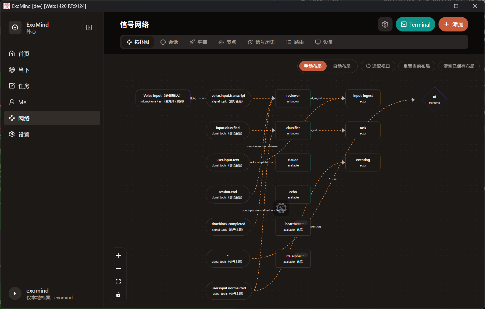
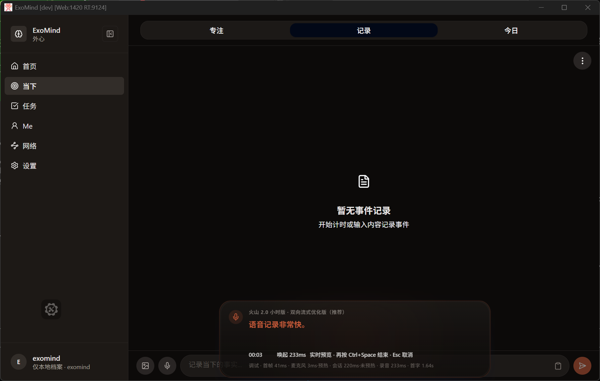

<div align="center">

# ExoMind

**Your life growth assistant.**

Local-first · Event-driven · AI-powered · Cross-platform

[](https://github.com/exomind-team/ccopl)
[](https://github.com/exomind-team/exomind/actions)
[](https://exo-mind.ai)
[](https://exo-mind.ai/download)

[中文文档](./README-zh.md) · [Website](https://exo-mind.ai) · [Download](https://exo-mind.ai/download)

[](https://qm.qq.com/q/cmPIiH5BpS)
[](./docs/wechat.md)

</div>

> [!WARNING]
> **Pre-1.0 — Expect breaking changes.** ExoMind is under active development with daily updates. APIs, data formats, and features may change without notice. We welcome contributors — come build with us!

---

## What is ExoMind

ExoMind is a cross-platform personal AI assistant built with Tauri v2 (Windows/macOS/Linux/Android). It focuses on event logging, time blocks, and multi-device sync — helping you record, reflect, and grow.

<div align="center">

<br>
<em>Signal Network — agents, actors, and signal topics working together</em>
<br><br>

<br>
<em>Voice Input — real-time speech recognition with event logging</em>
</div>

## Tech Stack

| Category | Technology |
|----------|-----------|
| Runtime | Bun |
| Frontend | React 18 + TypeScript + Vite |
| Desktop/Mobile | Tauri v2 |
| UI | Tailwind CSS + Radix UI + Lucide |
| State | Zustand |
| Storage | PouchDB (IndexedDB) |
| Router | TanStack Router |
| Test | Vitest + Playwright |

## Quick Start

### Prerequisites

- Bun (required)
- Rust stable toolchain (required)
- Node.js 20+ (recommended)
- Windows: Visual Studio Build Tools (C++)
- Android: Android SDK (API 34+) + JDK 17

### Install & Run

```bash
# Install dependencies
bun install

# Web development
bun run dev

# Tauri desktop development
bun run tauri dev

# Tauri Android development
bun run tauri android dev
```

### Multi-instance development

```bash
# Start desktop instance
bun tauri:manager start --name desktop

# Start Android instance
bun tauri:manager start --name phone --target android

# List running instances
bun tauri:manager list

# View logs
bun tauri:manager logs --name desktop --follow
```

## Common Commands

| Command | Description |
|---------|-------------|
| `bun run dev` | Start Vite dev server |
| `bun run server` | Start PouchDB sync server |
| `bun run tauri dev` | Desktop development |
| `bun run tauri android dev` | Android development |
| `bun run build` | TypeScript + Vite build |
| `bun run test` | Run unit tests |
| `bun run test:e2e` | Run E2E tests |
| `bun run build:tag` | Create build tag and trigger CI |

## Environment Variables

Copy `.env.example` to `.env` and adjust:

```bash
cp .env.example .env
```

Key variables:

| Variable | Default | Description |
|----------|---------|-------------|
| `EXOMIND_WEB_PORT` | auto | Vite dev port (default 1420) |
| `EXOMIND_POUCHDB_PORT` | `6984` | Sync server port |
| `EXOMIND_ASR_PORT` | `1949` | ASR service port |

See `.env.example` for the full list.

## Project Structure

```
exomind/
├─ src/                 # React frontend & business logic
├─ src-tauri/           # Tauri Rust backend & config
├─ crates/              # Rust crates (exomind-runtime)
├─ server/              # PouchDB sync server
├─ scripts/             # PowerShell/Bun automation
├─ tests/               # Vitest + Playwright tests
├─ docs/                # Documentation (architecture, specs, plans)
└─ website/             # Public website source
```

## Ecosystem

ExoMind is part of a larger ecosystem of open-source projects:

| Project | Description |
|---------|-------------|
| [ExoMind Cell](https://github.com/exomind-team/exomind-cell) | Operational closure VM for Cognitive Life Science experiments (Rust) |
| [Wattson](https://github.com/exomind-team/wattson) | Digital PSU monitoring — energy sensing layer (Rust) |
| [CCOPL](https://github.com/exomind-team/ccopl) | Contributors' Collective Ownership Public License |

## Documentation

> Documentation is primarily written in Chinese. English translations are provided where available.

- [Docs index](docs/README.md)
- [Development log](https://exomind-team.github.io/exomind-devlog/) (Chinese · AI-generated · experimental)
- [Architecture overview](docs/architecture/overview.md)
- [Product requirements](docs/product/PRD.md)
- [Product roadmap](docs/product/roadmap.md)
- [Development guide](CLAUDE.md)
- [Scripts guide](scripts/README.md)
- [Git workflow](docs/development/git-spec.md)

## Build & Release

```bash
# Daily build (auto-generates tag, uploads to R2)
bun run build:tag

# Formal release
git tag release/v0.3.3 && git push origin release/v0.3.3
```

## Community

| Platform | Link |
|----------|------|
| **QQ Group** | [外心 ExoMind 用户交流群](https://qm.qq.com/q/cmPIiH5BpS) |
| **WeChat** | [Scan QR to join](./docs/wechat.md) |

## Contributing

We welcome contributions! Please read our development guide in [CLAUDE.md](CLAUDE.md) for coding conventions and workflow.

## License

This project is licensed under the [Contributors' Collective Ownership Public License v1.0 (CCOPL-1.0)](https://github.com/exomind-team/ccopl).

See [LICENSE](LICENSE) and [LICENSE-zh](LICENSE-zh) for details.
