# ExoMind-Net 设计方案 v3

## 八层认知通讯基础设施

> **这是什么**：一份从物理设备到认知事件的统一分布式信号网络的完整设计方案。
>
> **做什么**：让个人和组织的所有计算设备——手机、电脑、手表、服务器、嵌入式传感器——自组织为一个统一整体，提供通讯、计算、存储和认知能力。
>
> - **个人层面**：你的所有设备互联互通，数据在自己手里，认知工具为你服务
> - **组织层面**：集体成员的设备资源共享，计算/存储/网络按贡献分配，基础设施归集体所有
>
> **为什么**：让认知生产资料——计算、存储、网络、数据——归个人和集体所有，不归资本平台。在信息世界中实现生产资料公有制，每个人的认知工具为自己服务，集体的基础设施为集体服务。
>
> **聚焦**：个人域（1-20 台设备）优先设计和实现，逐步扩展到集体域（组织内设备共享）、社区域、文明域。

---

## 一、设计目标

| # | 目标 | 含义 |
|---|------|------|
| 1 | 全分布式 | 节点自组织、自连接、自发现，无中心依赖 |
| 2 | 以人为中心 | 用户设备和数据归用户，认知工具为用户服务 |
| 3 | 自治 | 配对后资源（计算/存储/通讯）自动整合 |
| 4 | 认知生命科学引导 | 以认知生命科学理论框架指导设计 |
| 5 | 认知承载 | 承载人的认知 + Agent 的认知 |
| 6 | 生命实验环境 | 为创造认知生命提供可追溯的实验平台 |
| 7 | 文明基础设施 | 从个人设备到全人类设备的可扩展通讯标准 |

---

## 二、八层全景

### 2.1 总览图

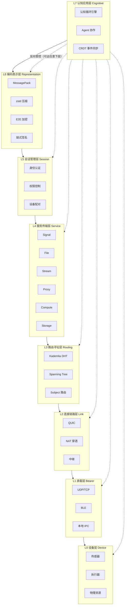

### 2.2 各层职责

```
层    名称                     职责                              关键技术
━━━━━━━━━━━━━━━━━━━━━━━━━━━━━━━━━━━━━━━━━━━━━━━━━━━━━━━━━━━━━━━━━━━━━━━━━━━━━
L7   认知应用层 Cognitive      认知循环 / Agent 协作              CognitiveEvent / CRDT
L6   编码表示层 Representation 序列化 / 压缩 / 加密 / 链式签名    MessagePack / zstd / E2E
L5   会话管理层 Session        身份 / 权限 / 设备配对             PAKE / Key Pinning / Ed25519
L4   服务传输层 Service        六类服务 + QoS                    Signal/File/Compute/Storage/Proxy/Stream
L3   路由寻址层 Routing        双模路由 / 服务发现                Kademlia + Spanning Tree
L2   连接链路层 Link           加密连接 / 多路复用 / 穿透         QUIC / NAT punch / relay
L1   承载层 Bearer             多网络适配                        UDP / BLE / LoRa / IPC
L0   设备层 Device             物理世界接口                      传感器 / 执行器 / 资源声明
```

### 2.3 一条信号从物理世界到认知世界

以手环心率信号为例，完整展示八层如何协作：

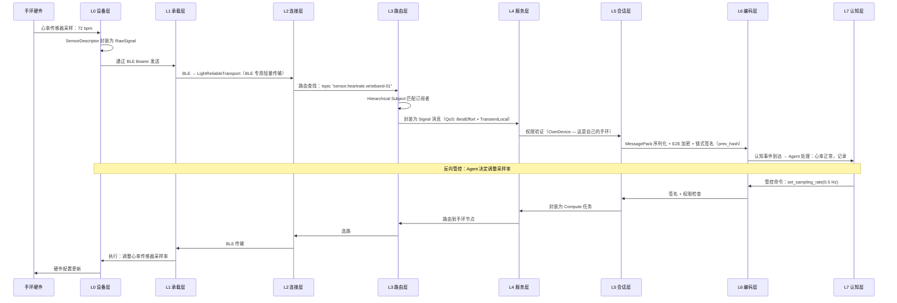

---

## 三、L0 设备层：物理世界接口

> L0 是信号网络与物理世界的边界。传感器是输入，执行器是输出，物理资源是约束。

### 3.1 L0 做什么

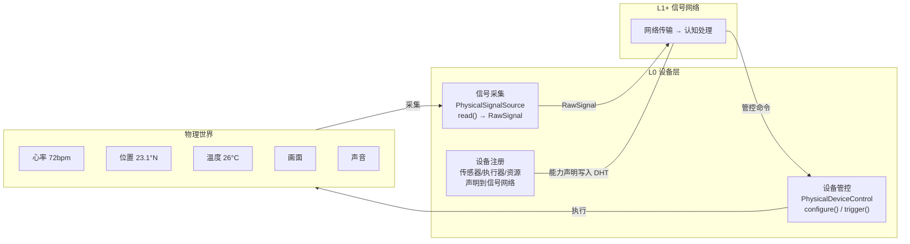

### 3.2 设备描述

每台设备加入信号网络时，L0 层向网络注册自己的物理能力：

```rust
struct DeviceLayer {
    node_id: NodeId,
    device_class: DeviceClass,         // Desktop / Portable / Persistent / Embedded
    sensors: Vec<SensorDescriptor>,    // 我有哪些传感器
    actuators: Vec<ActuatorDescriptor>,// 我有哪些执行器
    resources: DeviceResources,        // 我有多少计算/存储/能量资源
}

struct SensorDescriptor {
    sensor_type: SensorType,   // Heartrate / GPS / Camera / Microphone / Temperature ...
    sample_rate: SampleRate,
    data_format: DataFormat,
    power_cost: PowerCost,
}

struct ActuatorDescriptor {
    actuator_type: ActuatorType, // Display / Speaker / Vibration / Motor / LED ...
    control_interface: ControlInterface,
}

struct DeviceResources {
    cpu: CpuInfo,
    ram: MemoryInfo,
    gpu: Option<GpuInfo>,
    storage: StorageInfo,
    battery: Option<BatteryInfo>,
    power_source: PowerSource,     // Battery / AC / Solar
}
```

### 3.3 L0 与 L7 的双向因果

L7 认知层可以通过标准的 L4 Compute 服务管控 L0 的任何设备：

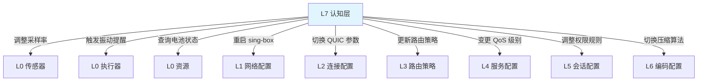

关键点：L7 能反向管控**任意下层的任意层级**（L0 到 L6），不限于特定层。所有管控命令都走标准 L4 Compute 路径（opaque task），不破坏分层原则。

---

## 四、L1 承载层：多网络适配

> L1 适配不同的底层网络，对上层暴露统一的发包/收包接口。

### 4.1 承载类型

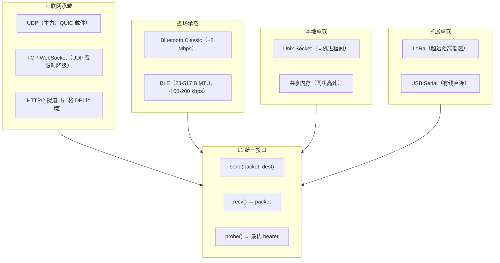

### 4.2 BLE 专用适配

QUIC 对 BLE 太重（握手开销大、头部占比高）。设计了 LightReliableTransport：

- 滑动窗口 1-4（极小）
- 分片器：大帧 → BLE 小包（适配 23-517 B MTU）
- 简单重传定时器
- 不做拥塞控制（BLE 带宽本就很低）

### 4.3 自动降级与迁移

- 同时持有多种 Bearer，运行时自动选最优
- WiFi → 4G 切换时，QUIC 连接迁移（Connection ID 不变）
- UDP 被封 → 自动降级到 TCP-WebSocket → HTTP/2 隧道

---

## 五、L2 连接链路层：QUIC + NAT 穿透

> L2 在两个节点之间建立可靠、加密、多路复用的连接。

### 5.1 连接架构

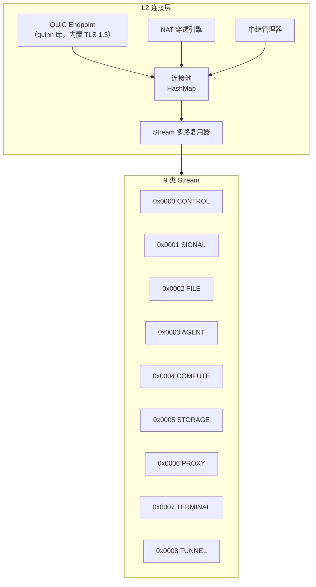

### 5.2 NAT 穿透策略

| 双方 NAT 类型 | 策略 | 成功率 |
|-------------|------|-------|
| 双方锥形 | 简单 UDP 打洞 | >90% |
| 一方对称 | 端口预测 + 生日攻击 | ~40% |
| 双方对称 | 基本不可能 | <5% |
| 运营商 CGNAT | 打洞困难 | ~20% |

打洞失败 → 自动降级为中继。**任何节点都可以做中继**，不只是固定服务器。

### 5.3 能力协商

连接建立时交换 NodeCapabilities（包含 L0 设备层的物理资源声明）：

```rust
struct NodeCapabilities {
    device_class: DeviceClass,
    can_relay: bool,
    relay_bandwidth_mbps: u32,
    storage_available_gb: u64,
    compute_cores: u32,
    gpu_vram_mb: u32,
    sensors: Vec<SensorType>,       // L0 传感器列表
    actuators: Vec<ActuatorType>,   // L0 执行器列表
    battery_percent: Option<u8>,    // L0 电池状态
    protocol_version: u32,
    supported_streams: Vec<u16>,
}
```

---

## 六、L3 路由寻址层：双模路由

> L3 负责"信号发到哪去"——精确查找用 DHT，组播/广播用 Spanning Tree。

### 6.1 双模路由架构

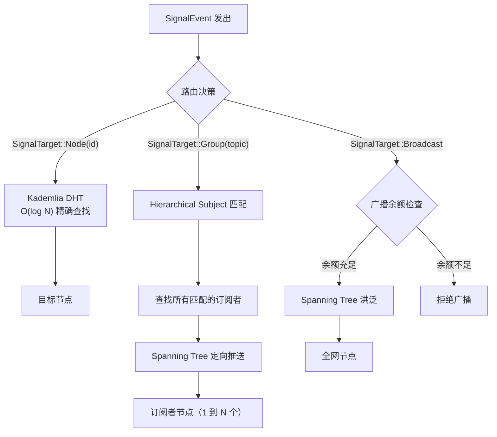

### 6.2 Hierarchical Subject 路由

Subject 支持通配符，用前缀树（Trie）匹配：

```
精确匹配：  "agent.life.exploring"     → 只匹配这一个
单层通配：  "agent.life.*"             → 匹配 agent.life.exploring、agent.life.dormant
多层通配：  "agent.>"                  → 匹配 agent 下所有子 topic
```

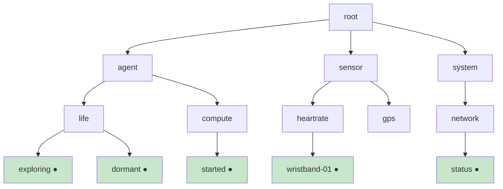

订阅 `sensor.heartrate.*` → 匹配所有心率传感器的信号。

### 6.3 广播模型

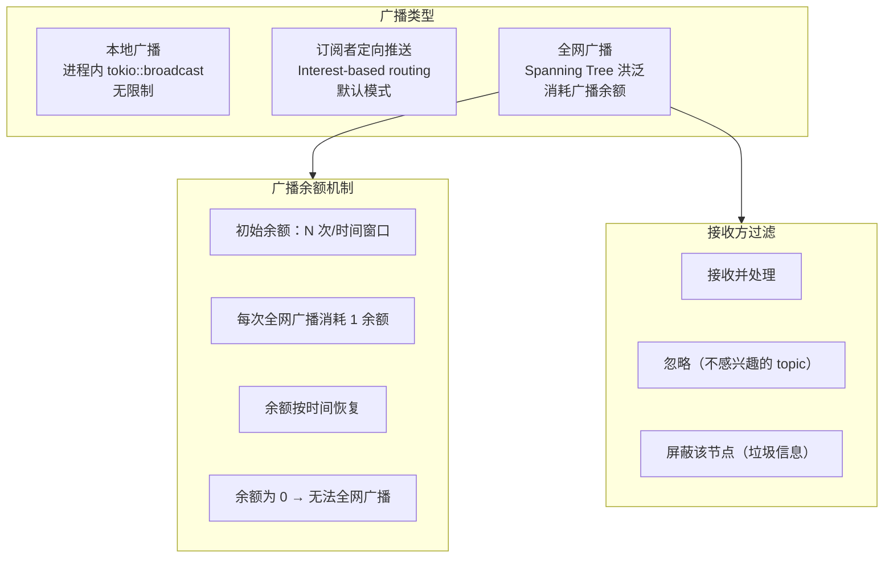

**广播余额机制**：
- 每个节点有广播余额（如每小时 N 次全网广播）
- 每次全网广播消耗 1 余额
- 余额随时间恢复
- 余额为 0 时无法发起全网广播
- 仅限全网广播消耗余额；订阅者定向推送不受限

**接收方权利**：
- 每个节点有权过滤收到的广播
- 可按 topic 忽略
- 可按来源节点屏蔽
- 这是信号网络的基本设计——接收方始终有自主权

**关于政府/监管的讨论**：

在完全去中心化的信号网络中，不存在"保证所有人必须接收某条信息"的技术机制——每个节点有过滤权。这带来两个需要思考的问题：

1. **紧急公共信息**（如自然灾害预警）：可以设计一种"紧急广播"信号类型，由多个信任节点联合签名背书（类似多签），接收方的默认策略是不过滤紧急广播。但这是建议性的——技术上无法强制。

2. **政府监管需求**：完全去中心化的网络天然不支持中心化监管。这不是技术缺陷——这是设计目标的一部分（目标 2：以人为中心）。如何在去中心化与合规之间找到平衡，需要在更广泛的社会讨论中解决，不在本技术设计的范围内。但我们不回避这个问题——在论文四（政治经济学）中应展开讨论。

### 6.4 节点身份与地址

- **NodeId**：Ed25519 公钥 → SHA-256 前 20 字节（自证明身份）
- **虚拟 IP**：10.{id[0]}.{id[1]}.{id[2]}（确定性生成，便于路由）
- **三级发现**：mDNS（局域网）+ BLE 广播（近场 ~10 m）+ Kademlia DHT（广域网）

---

## 七、L4 服务传输层：六类服务 + QoS

> L4 把 L2 的原始 QUIC stream 封装为具体服务。每种服务有默认 QoS。

### 7.1 QoS 框架

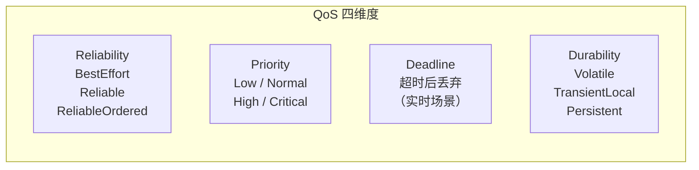

| 信号类型      | Reliability     | Priority | Deadline | Durability     |
| --------- | --------------- | -------- | -------- | -------------- |
| 认知事件      | ReliableOrdered | High     | —        | Persistent     |
| 心跳        | BestEffort      | Low      | 10s      | Volatile       |
| 管控命令      | Reliable        | Critical | 5s       | —              |
| 传感器采样     | BestEffort      | Normal   | —        | TransientLocal |
| 文件块       | Reliable        | Normal   | —        | Persistent     |
| Agent 输出流 | BestEffort      | High     | —        | Volatile       |

### 7.2 六类服务

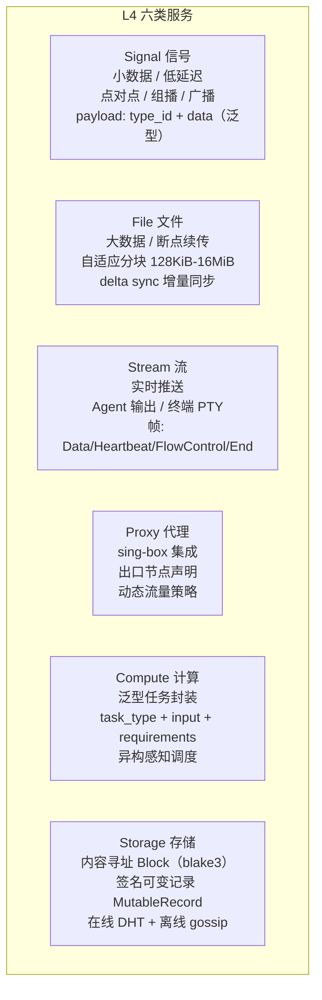

### 7.3 签名事件链

每条 SignalEvent 引用前一条的哈希，构成不可篡改的因果链：

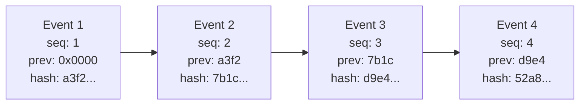

```rust
struct SignalEvent {
    id: Uuid,
    topic: String,
    timestamp: u64,
    source: String,
    origin_host_id: Uuid,
    hop: u8,
    payload: Bytes,
    // 链式签名（新增）
    prev_hash: [u8; 32],
    sequence: u64,
    signature: Ed25519Signature,
}
```

- 篡改任何一条 → 后续所有事件的 prev_hash 验证失败
- 离线验证：收到事件链后本地即可验证完整性
- 为 CRDT 提供因果序基础

### 7.4 异构感知调度

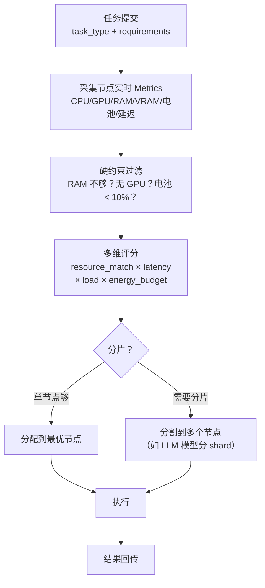

### 7.5 Source Chain：节点行为日志

每个节点维护本地 append-only 日志（SQLite），记录发出和处理的所有事件：

```rust
struct SourceChain {
    node_id: NodeId,
    // SQLite append-only 表
}

struct SourceEntry {
    sequence: u64,
    timestamp: u64,
    prev_hash: [u8; 32],
    action: Action,            // Publish / Receive / Execute / Migrate
    event_ref: Option<EventId>,
    signature: Ed25519Signature,
}
```

Source Chain 是签名事件链在节点级别的体现：
- 签名事件链：证明"这条事件确实存在且未被篡改"
- Source Chain：证明"这个节点确实做了这些事情"

---

## 八、L5 会话管理层：身份、认证与权限

> L5 解决三个问题：你是谁（身份）、我信不信你（认证）、你能做什么（权限）。

### 8.1 身份：自证明，不依赖第三方

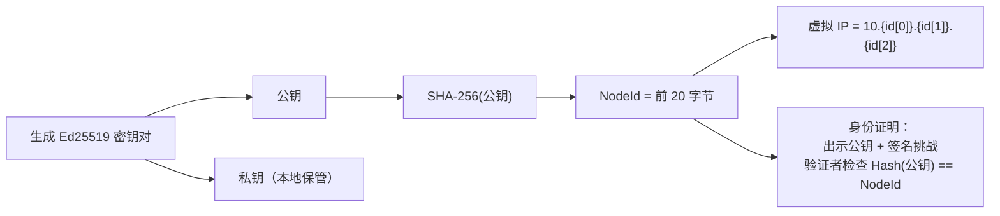

身份来自密码学，不来自任何第三方：
- 节点启动 → 生成 Ed25519 密钥对
- 公钥的哈希就是身份（NodeId）
- 要证明"我是 NodeId_X"：出示公钥 + 用私钥签名一个挑战
- 任何人都能验证，不需要 CA

### 8.2 认证：个人域的设备配对

个人域（1-20 台设备）的核心场景是"把新设备加入我的网络"。

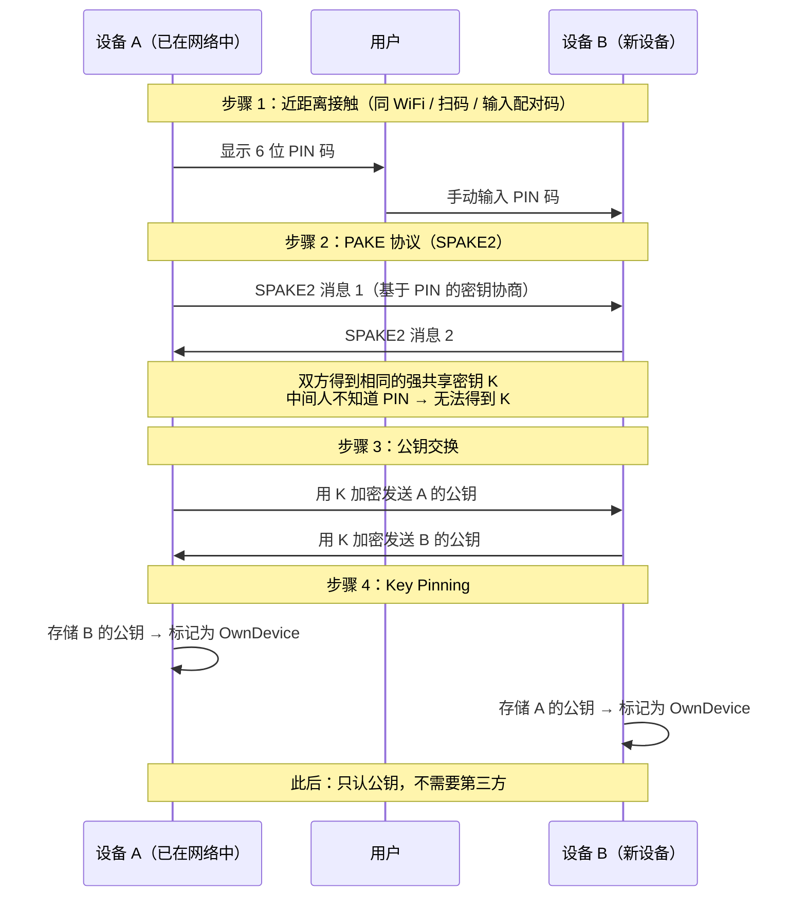

配对完成后，两台设备建立了持久的信任关系：
- 后续连接只需出示公钥 + 签名验证
- Key Pinning：如果对方出示了不认识的公钥 → 拒绝（有人冒充）
- 不需要 CA、不需要协调服务器

### 8.3 权限：按身份分级

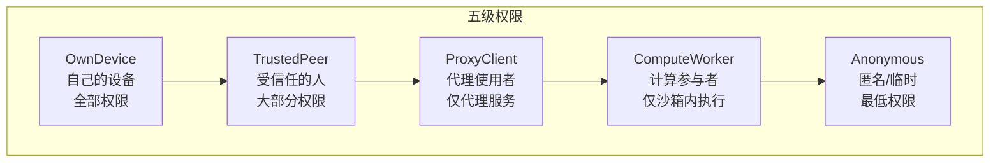

| 权限          | OwnDevice | TrustedPeer | ProxyClient | ComputeWorker | Anonymous |
| ----------- | :-------: | :---------: | :---------: | :-----------: | :-------: |
| 执行代码        |     是     |      是      |      否      |      沙箱内      |     否     |
| 访问文件系统      |     是     |    受限路径     |      否      |       否       |     否     |
| 使用代理        |     是     |      是      |      是      |       否       |     否     |
| 调度计算        |     是     |      是      |      否      |       否       |     否     |
| 访问存储        |     是     |      是      |      否      |       否       |     否     |
| 管控设备（L0-L6） |     是     |      否      |      否      |       否       |     否     |

### 8.4 安全防御

**三层重放防御**：
1. QUIC/TLS 包序列号 + AEAD → 重复序列号自动丢弃
2. ExoMind 帧 nonce（8 字节随机数）→ 已见 nonce 集合 + 5 分钟超时窗口
3. 业务层幂等 → 事件全局唯一 ID（ULID），相同 ID 只处理一次

**密钥吊销**：
- 设备被盗/被黑 → 在其他设备操作"移除此设备"
- 将该公钥加入黑名单 → 主密钥签名吊销声明 → DHT 广播

**Eclipse 攻击防御**：
- 路由表多样性 + 签名验证 + 多路径查询

### 8.5 公共域（简述）

> 公共域的完整设计需要结合集体所有制模型，详见 独立文档（待撰写）。此处仅概述接入方式。

公共域节点通过自证明身份加入网络（无需 PAKE 配对），权限受限于 Anonymous 或更高级别（由公共域的治理规则决定）。公共域支持的应用场景包括分布式论坛、文件共享、即时通讯、虚拟世界等——任何人可以开发应用接入信号网络的 L4 服务接口。

详见 独立文档（待撰写）。

---

## 九、L6 编码表示层：帧格式与编解码

> L6 把上层的结构化消息变成可在网络中传输的字节流。

### 9.1 帧格式

```
┌──────────┬──────────┬──────────┬──────────┬──────────┬──────────┐
│ Magic(2) │ Flags(1) │ Nonce(8) │ Len(4)   │ TypeId(2)│ Payload  │
│ 0xEE 0x4D│          │ 防重放   │ 负载长度  │ 消息类型  │ 序列化数据│
└──────────┴──────────┴──────────┴──────────┴──────────┴──────────┘
```

Flags（bitflags）：
```
bit 0: COMPRESSED    zstd 压缩
bit 1: ENCRYPTED     E2E 加密（默认开启）
bit 2: FRAGMENTED    大消息分片
bit 3: STREAM        流式消息
bit 4: PRIORITY      高优先级
bit 5: CHAINED       链式签名（引用 prev_hash）
```

### 9.2 编解码管线

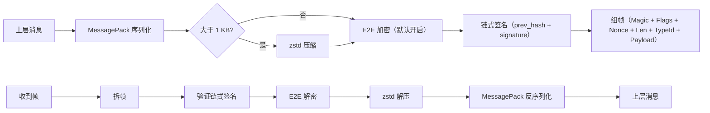

---

## 十、L7 认知应用层：承载接口

> L7 是信号网络的最高层。本文档定义 L7 的承载接口；认知语义的详细设计见论文三。

L7 通过 L4 的 opaque payload 接口与 L0-L6 解耦：

```
L4 Signal payload:   type_id: u16 + data: Bytes（泛型）
L7 注册认知类型:      Awareness=0x0100, Choice=0x0101, Action=0x0102 ...

L4 Compute task:     task_type: String + input: Bytes + requirements: ResourceReq
L7 定义任务类型:      "agent_inference", "code_execution", "knowledge_search" ...
```

L0-L6 不解释 L7 的内容（内容无关性 / opaque payload）。这保证了信号网络的通用性——同一网络既能传物理管控命令，也能传认知事件，也能传第三方应用的自定义消息。

---

## 十一、上层管控下层：自管理能力

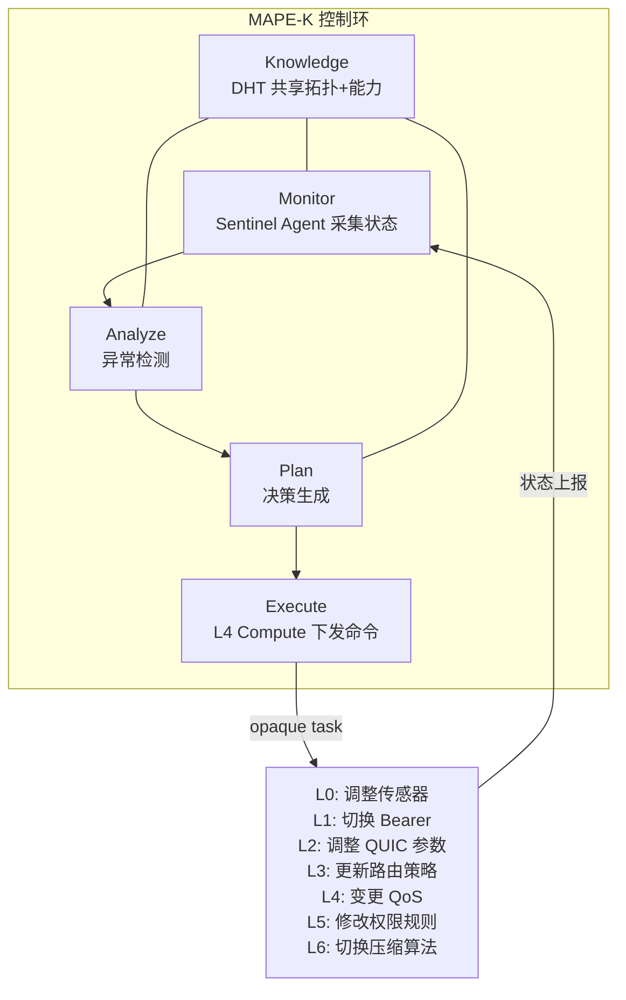

这是信号网络与传统网络栈的根本区别：
- 传统网络：物理层承载上层，单向
- ExoMind-Net：上层通过标准 L4 服务管控任意下层，双向

管控命令对网络来说只是一个 opaque Compute task——不破坏分层原则。

---

## 十二、公共域应用生态

> 信号网络不只服务 ExoMind——它是一个开放的应用平台。

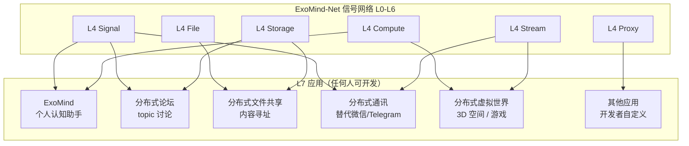

核心原则：
- ExoMind 是信号网络上的**一个**应用，不是唯一的
- 所有应用通过 L4 六类服务接口接入
- 谁使用谁贡献计算资源
- 没有任何一个人控制整个平台
- 公共域的治理和资源分配详见 独立文档（待撰写）

---

## 十三、设计规模

> 个人域优先。每一层都是完整可用的产品状态。

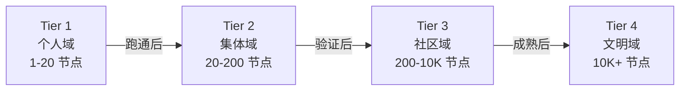

| 规模 | 发现 | 路由 | 安全 | 聚焦 |
|------|------|------|------|------|
| **个人域 (1-20)** | mDNS + BLE | Kademlia | PAKE 配对 | **当前优先** |
| 集体域 (20-200) | DHT | Kademlia | PAKE + 公共域 | 中期 |
| 社区域 (200-10K) | DHT | Kademlia + Spanning Tree | 公共域分级 | 远期 |
| 文明域 (10K+) | 分层 DHT | 分层 DHT + 联邦 | 联邦认证 | 长期愿景 |

---

## 十四、社会意义

### 14.1 我们在做什么

在信息世界中实现生产资料公有制：

| 维度  | 当前（资本平台）             | ExoMind-Net      |
| --- | -------------------- | ---------------- |
| 计算  | AWS/Azure 按时计费       | 个人/集体设备池化        |
| 存储  | Google Drive 数据在别人手里 | 个人设备加密存储 + 集体冗余  |
| 通讯  | 微信/Slack 平台垄断        | P2P 信号网络，无中心     |
| 认知  | ChatGPT API 认知外包给资本  | Agent 在自己设备上运行   |
| 数据  | 用户数据是平台的产品           | 用户数据归用户（个人域不可侵犯） |

### 14.2 与比特币的对标

| 维度   | 比特币（Nakamoto 2008） | ExoMind-Net        |
| ---- | ------------------ | ------------------ |
| 提出什么 | P2P 电子现金系统         | P2P 认知通讯基础设施       |
| 解决什么 | 无需信任第三方的价值转移       | 无需信任第三方的认知协作       |
| 技术核心 | 哈希链 + 工作量证明        | 签名事件链 + 自证明身份      |
| 社会意义 | 去中心化金融（但仍在资本逻辑内）   | 认知生产资料的公有制——超越资本逻辑 |

比特币在金融领域实现了去中心化，但仍服务于资本增殖。ExoMind-Net 的目标不同——让计算、存储、通讯、认知这些生产资料归个人和集体所有，不是为了赚钱，而是为了人的全面发展。

### 14.3 论文 vs 白皮书

```mermaid
graph TB
    subgraph WP["白皮书（标准提案）"]
        WPC["完整八层设计 + 愿景 + 社会意义<br/>面向所有人<br/>先发，锁 DOI"]
    end

    subgraph Papers["论文系列（学术深度）"]
        P1["论文一：认知生命科学（理论）"]
        P2["论文二：L0-L6 信号网络（技术）"]
        P3["论文三：L7 认知引擎（技术）"]
        P4["论文四：政治经济学（社会）"]
    end

    WP <-->|"互相引用"| Papers
    P1 -->|"理论基础"| WP
    P2 -->|"网络技术"| WP
    P3 -->|"认知技术"| WP
    P4 -->|"社会理论"| WP
```

建议并行推进：白皮书先发（全景概览 + DOI 锁定），论文系列提供技术深度。

---

## 十五、工程实现

### 15.1 Crate 结构

```
exomind/
├── exomind-core/           # 公共基础：NodeId、密钥、配置
├── exomind-device/         # L0 设备层 [新增]
│   ├── sensor.rs
│   ├── actuator.rs
│   └── resources.rs
├── exomind-net/            # L1-L3 + L6：网络协议栈
│   ├── bearer/             #   L1 承载层
│   ├── link/               #   L2 连接层
│   ├── routing/            #   L3 路由层（Kademlia + Spanning Tree）
│   └── repr/               #   L6 表示层
├── exomind-session/        # L5 会话层
├── exomind-svc/            # L4 服务层
│   ├── signal/  file/  proxy/  compute/  storage/  terminal/
│   └── qos.rs              #   QoS 框架 [新增]
├── exomind-rt/             # L7 认知运行时（见论文三）
├── exomind-embedded/       # 嵌入式精简版 (no_std)
├── exomind-app/            # Tauri 桌面/移动端
├── exomind-node/           # 完整节点程序
└── exomind-cli/            # 命令行工具
```

### 15.2 层间依赖

```mermaid
graph TB
    RT["exomind-rt (L7)"] --> SVC["exomind-svc (L4)"]
    SVC --> SESSION["exomind-session (L5)"]
    SESSION --> NET["exomind-net (L1-L3, L6)"]
    NET --> DEVICE["exomind-device (L0)"]
    DEVICE --> CORE["exomind-core"]
    NET --> CORE
    SESSION --> CORE
    SVC --> CORE
    RT --> CORE
```

---

## 十六、v1 → v3 差异总表

| 维度 | v1（七层） | v3（八层） | 来源 |
|------|-----------|-----------|------|
| 层数 | L1-L7 | L0-L7 | 用户确认 |
| L0 设备层 | 无 | 传感器/执行器/物理资源 | 用户确认 |
| L3 路由 | Kademlia 单模 | Kademlia + Spanning Tree 双模 | Yggdrasil |
| L3 Subject | 精确匹配 | Hierarchical 通配符 | NATS |
| L3 广播 | 无约束 | 广播余额 + 接收方过滤 | 用户反馈 |
| L4 QoS | 无 | reliability/priority/deadline/durability | DDS/ROS 2 |
| L4 File | 256KB 固定分块 | 128 KiB-16 MiB 自适应 + delta sync | Syncthing BEP |
| L4 Compute | 简单评分 | 异构感知多维调度 + 实时 metrics | Prima.cpp Halda |
| L4 签名 | 单条签名 | 链式签名（prev_hash） | SSB + Holochain |
| L5 认证 | 纯个人域 | 个人域优先 + 公共域简述 | 用户反馈 |
| L6 E2E | 可选 | 默认开启 | Matrix + 用户确认 |
| L7 管控范围 | L1 物理配置 | L0-L6 任意层级 | 用户确认 |
| Source Chain | 无 | SQLite append-only | Holochain |
| 规模 | 未定义 | 四层（个人→文明），个人域优先 | 用户反馈 |
| 定位 | 技术规范 | 标准提案/白皮书级 | 用户确认 |
| 社会意义 | 未涉及 | 认知生产资料公有制 | 用户确认 |

---

## 十七、下一步

1. **用户确认本方案** → 更新 ExoMind-Net 技术规范至 v0.2
2. **起草白皮书初稿**（基于本文档，通俗语言重写）
3. **更新论文二框架**（八层架构 + 新实验设计）
4. **同步代码库** PR #595
5. **公共域独立文档** → 已有 独立文档（待撰写），持续更新

---

*文档版本：v3.0*
*创建日期：2026-03-19*
*负责人：architect teammate*
