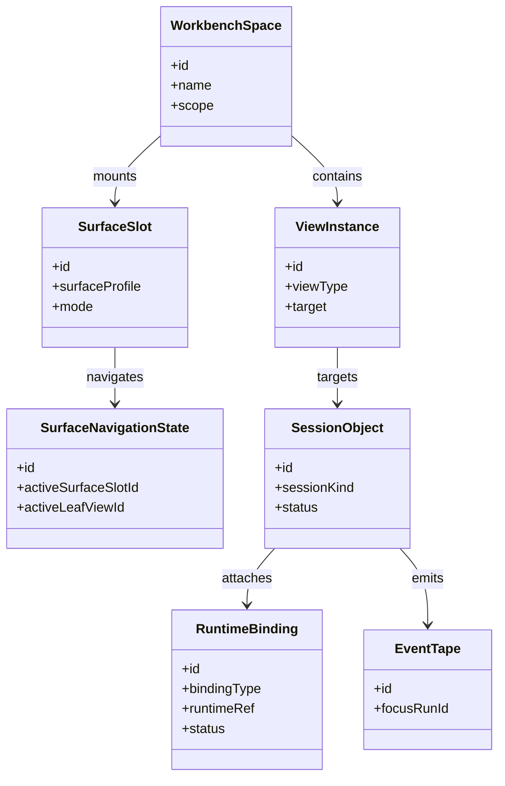
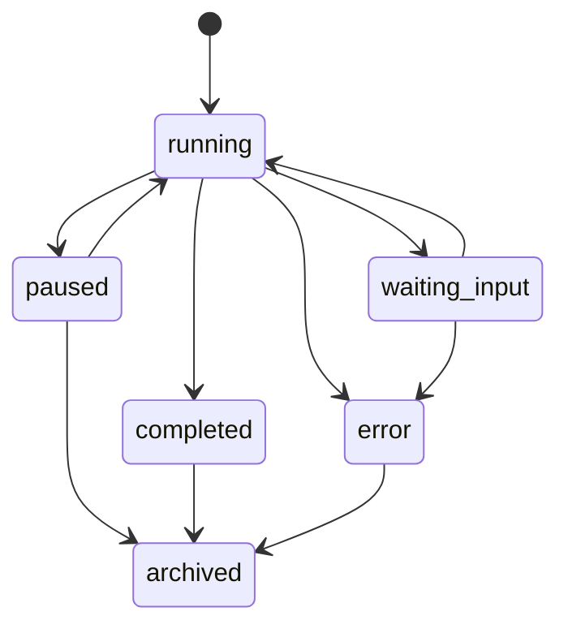
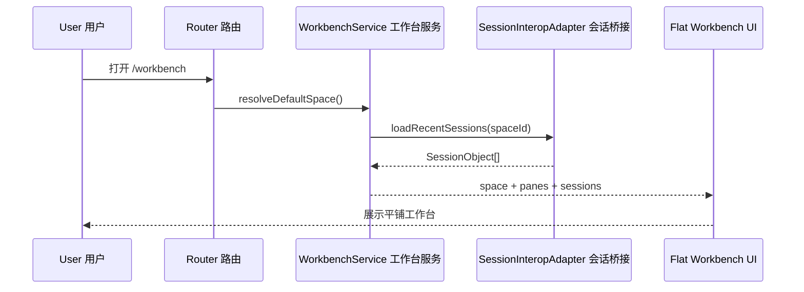
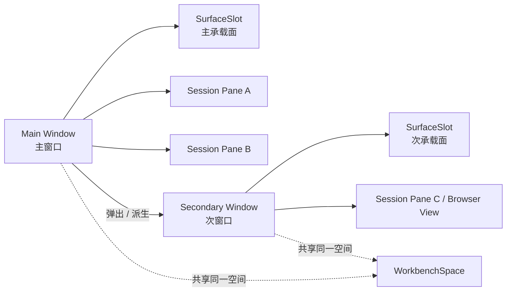

# Agent Workbench Phase 1：平铺工作台与跨窗口联邦前置抽象

> 日期：2026-03-30  
> 状态：review pending（待评审）  
> 类型：architecture / implementation design（架构 / 实施设计）  
> 关联：
> - Parent Epic: `#728`
> - 相关：`#385`、`#535`、`#646`、`#702`
> - 上位规格：`docs/architecture/agent-workbench-shared-graph-spec.md`

---

## 1. 这份文档解决什么问题

这份文档不是再讨论长期愿景，而是把 `Agent Workbench` 的第一阶段收敛成可以直接开工的范围。

当前判断是：

1. 不先做自由画布
2. 不先做完整窗口管理器
3. 先做一个稳定的 `Flat Workbench（平铺工作台）`
4. 先让 `agent / PTY / SSH / browser runtime` 能被统一纳管
5. 先把多个窗口共享同一 `WorkbenchSpace（工作空间）` 的联邦骨架立起来

一句话概括：

> Phase 1 不是“先把 UI 做自由”，而是“先让多个运行时工作面在同一个工作空间里稳定存在、稳定恢复、稳定跨窗口协同”。

---

## 2. 目标与非目标

## 2.1 目标

1. 交付一个稳定的 `WorkbenchPage`
2. 同一 `WorkbenchSpace` 下可恢复多个会话 pane
3. `SessionObject + RuntimeBinding` 统一承载现有 `AgentSession`、PTY、SSH，并预留 `browser runtime`
4. 新增第二窗口时，仍然工作在同一个共享空间与同一个共享对象模型上
5. 事实层先打通 `FocusRun + EventTape`

## 2.2 非目标

1. 不做自由画布拖拽编排
2. 不做完整 `network` 编辑器
3. 不做完整插件系统
4. 不做任意对象类型一次性统一
5. 不做完整 browser automation（浏览器自动化）协议

---

## 3. Phase 1 核心对象与最小关系

## 3.1 核心对象

1. `WorkbenchSpace`
   - 长期工作空间
   - 回答“我当前在哪个工作场景里干活”
2. `ViewInstance`
   - 平铺 pane 的语义视图
3. `SurfaceSlot + SurfaceNavigationState`
   - 当前窗口/承载面的语义挂载点
4. `SessionObject`
   - 一次会话过程的历史容器
5. `RuntimeBinding`
   - 真实运行时句柄
   - Phase 1 首批类型：`agent-session / pty / ssh / browser-runtime`
6. `EventTape`
   - 事实流
   - 记录输入、输出、控制事件

## 3.2 最小关系集

Phase 1 只要求下面这组关系稳定存在：

1. `space_contains`
2. `surface_shows`
3. `session_anchors_to`
4. `session_attaches_runtime`
5. `session_emits_event`

说明：

1. 这不是最终全部关系类型
2. 但足以支撑“一个空间、多个 pane、多个运行时、多个窗口、同一事实流”

## 3.3 核心对象图

## 3.4 `SessionObject` 生命周期

---

## 4. 三条关键用户旅程

## 4.1 打开默认工作台

用户看到的效果是：

1. 不是回到一个空白页
2. 而是回到最近工作的空间
3. 最近活跃的多个会话以平铺 pane 的方式恢复出来

## 4.2 在同一空间里新增运行时 pane

1. 用户选择新建 `agent / PTY / SSH / browser runtime`
2. 系统创建 `SessionObject`
3. 系统创建对应 `RuntimeBinding`
4. 新 pane 进入当前 `WorkbenchSpace`
5. 该会话的输入/输出开始进入 `EventTape`

这里的重点不是 UI，而是：

1. 新运行时不再各自长一套页面语义
2. 而是统一进入 `SessionObject + RuntimeBinding`

## 4.3 从主窗口派生第二窗口

这里要保证：

1. 两个窗口看的不是两套独立状态
2. 而是同一 `WorkbenchSpace` 的不同投影子集

---

## 5. 实施切片

## 5.1 Slice A：Flat Shell

交付：

1. `WorkbenchPage.tsx`
2. `flat preset（平铺预设）`
3. `/workbench` 路由入口
4. `/agents/*` shim

验收：

1. 页面能打开
2. 可稳定显示多个 pane
3. 不破坏当前移动端二级页面

## 5.2 Slice B：Session / Runtime Federation

交付：

1. `SessionInteropAdapter`
2. 统一 `RuntimeBinding`
3. `AgentSession -> SessionObject` 映射
4. `PTY / SSH -> RuntimeBinding` 映射

验收：

1. 旧会话可恢复
2. 多运行时可共存
3. 语义上不再把 PTY 节点伪装成 agent

## 5.3 Slice C：Cross-Window Skeleton

交付：

1. 主窗口打开次窗口的最小链路
2. `SurfaceSlot` 与窗口承载关系
3. 窗口间共享空间与活动会话集合

验收：

1. 次窗口可打开
2. 次窗口能展示同一空间下的子集工作面
3. 不要求任意停靠与拖拽

## 5.4 Slice D：EventTape Ingress

交付：

1. `FocusRun` 基础接入
2. `EventTape` 追加写入
3. 会话输入/输出/系统控制事件入流

验收：

1. 基础时间线可回放
2. 派生层有稳定来源链路

## 5.5 Slice E：Recovery / Review Read Model

交付：

1. 会话列表 + active panes 读模型
2. 空间恢复逻辑
3. outcome / inspector 的基础只读面板

验收：

1. 关闭重开后可恢复最近工作台
2. 文档中的对象模型与实际实现结构一致

---

## 6. 现有代码映射

1. [AgentsPage.tsx](../../src/ui/app/pages/AgentsPage.tsx)
   - 提供多会话、PTY、详情面板、移动端入口经验
   - 但对象语义需要被桥接，而不是直接复用
2. [TaskDagPage.tsx](../../src/ui/app/pages/TaskDagPage.tsx)
   - 提供 inspector 共存与状态恢复经验
3. [routes.tsx](../../src/routes.tsx)
   - 需要建立 `/workbench` 与 `/agents/*` shim
4. [issue-646-deep-analysis.md](../analysis/issue-646-deep-analysis.md)
   - 提供多窗口、聚合、回退和状态同步研究

---

## 7. 风险与评审点

## 7.1 主要风险

1. 如果 Phase 1 又偷偷回到自由画布，会拖慢交付
2. 如果 `browser runtime` 只写进文案、不进模型，后续还会断层
3. 如果窗口层没有“共享同一空间语义”，会退化成多个孤立页面
4. 如果 `EventTape` 不先打通，结构化层后面会变成伪真相

## 7.2 评审时重点看什么

1. 当前阶段是否真的收敛到了 `Flat Workbench`
2. `SessionObject + RuntimeBinding` 是否已经成为统一入口
3. 次窗口是否共享同一 `WorkbenchSpace`
4. 文档和 issue 的阶段切分是否足够清楚

---

## 8. 结论

Phase 1 的正确交付物，不是一个很自由的 UI，而是一个：

1. 能恢复
2. 能跨窗口
3. 能统一纳管多运行时
4. 能留下事实流

的稳定工作台。

只要这层打稳，后面的 `canvas / network / replay` 都是在同一底座上长出来，而不是另起一套产品。
