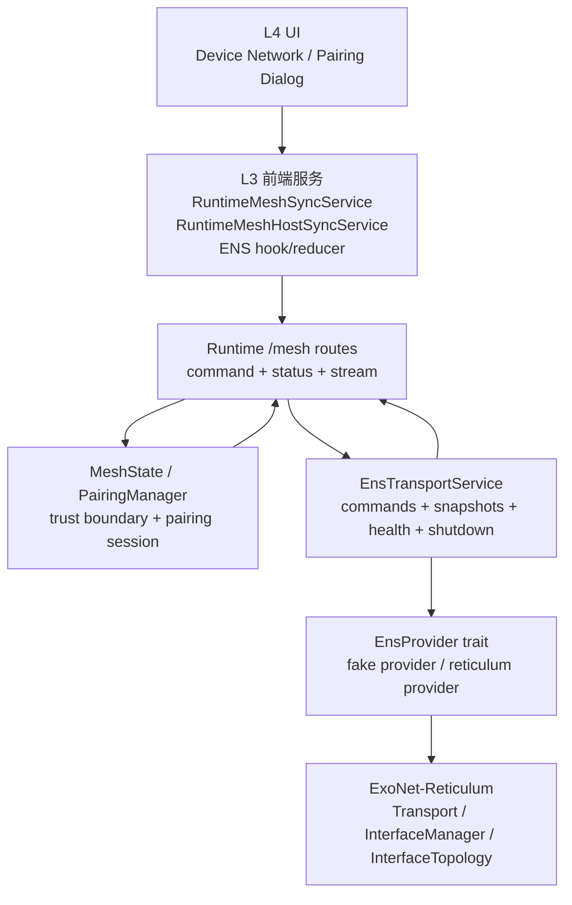

# ENS / Reticulum 全新开发实施计划

> 历史实施记录，不是当前权威计划。当前目标、契约与验收标准见 `2026-06-08-reticulum-signal-event-data-plane-and-interface-migration-plan.md`；无上下文接手入口见 `2026-06-08-reticulum-next-agent-handoff.md`；人工与自动验收路径见 `../development/reticulum-dual-instance-verification.md`。
>
> 本文件保留阶段 checkpoint、已完成纵切和旧分支迁移判断，供考古和回归定位使用；不要把其中的阶段状态当成最新待办清单。
>
> **执行禁令**：以下旧任务列表、旧 route 草案和旧 SSE 表述不得作为当前待办执行。当前下一步只以 `2026-06-08-reticulum-next-agent-handoff.md` 的“当前暴露面与阻塞缺口”和“下一步实施顺序”为准。

> 日期：2026-06-08
> 工作树：`H:\A137442\Develop\AGI\exomind-reticulum`
> 当前分支：`codex/ens-reticulum-adapter`
> 基线：当前 `origin/dev`，不是旧 `feat/ret-mesh-prototype`
> 记录状态：历史 in-progress 截面，fake control/data-plane、signed queue EventLog、dynamic UDP EventLog、JSONL/file EventLog、dynamic TCP server/client 四域同步、mDNS `ret_port` bootstrap、Reticulum debug snapshot、runtime startup config 与 endpoint 发布保护纵切已完成；不要把本行当成当前待办或完成状态。

## 目的

本计划把旧 Reticulum 原型分支的考古成果转化为一条从当前 `dev` 重新出发的实施路线。

核心判断：

1. 旧分支是资产来源，不是 merge base。
2. 要迁移的是行为规格、协议语义、测试场景和现场经验。
3. 不迁移旧代码形状，尤其不迁移巨型后台循环、旧 path dependency、Reticulum-only route island 和单体 UI。

本计划的目标不是“修活旧分支”，而是在当前 ExoMind runtime mesh 主线上补出一个可维护、可测试、可演进的 ENS / Reticulum adapter。

## 阶段进展

### 2026-06-08：ENS fake 双节点握手闭环

已完成：

- 新增 `crates/exomind-runtime/src/ens/` 模块骨架、typed DTO、provider trait、fake provider 与 service。
- 新增 `PairingComplete` frame，使 fake 协议从单侧授权推进到双侧授权：
  `A PairingOffer -> B pending -> B PairingResponse -> A authorize B -> A PairingComplete -> B authorize A`。
- `EnsTransportService` 在 service 层投影到 `MeshState`，继续以 `identity_hex` 作为 peer key，以 `host_id` 作为 metadata。
- `PairingManager` 增加 `cancel`，用于 ENS cancel 投影为可观察的 cancelled operation。
- 新增 `crates/exomind-runtime/tests/ens_control_plane_prototype.rs`，覆盖 frame round-trip、单侧授权、双节点互信、错误 PIN、cancel、provider send failure、本地 endpoint 缺失等路径。

本阶段刻意未做：

- 未接 `AppState`。
- 未接 routes / UI。
- 未接真实 `ExoNet-Reticulum` dependency。
- 未引入后台 loop。

验证结果：

```powershell
rustfmt --edition 2024 --check crates/exomind-runtime/src/pairing.rs crates/exomind-runtime/src/ens/mod.rs crates/exomind-runtime/src/ens/dto.rs crates/exomind-runtime/src/ens/pairing_protocol.rs crates/exomind-runtime/src/ens/provider.rs crates/exomind-runtime/src/ens/fake_provider.rs crates/exomind-runtime/src/ens/service.rs crates/exomind-runtime/tests/ens_control_plane_prototype.rs
cargo test -j 1 -p exomind-runtime --test ens_control_plane_prototype -- --nocapture
cargo test --lib -j 1 -p exomind-runtime pairing::tests::cancel_removes_session -- --nocapture
cargo check --lib -j 1 -p exomind-runtime
```

当前已知限制：

- 仍是 fake provider service-level 原型，不代表真实 Reticulum transport contract 已稳定。
- `PairingComplete` 当前只覆盖 happy-path 双侧授权；timeout、dual-initiation resolution、真实链路丢包重试仍需后续阶段补齐。
- 全仓库测试仍可能撞到既有无关失败，已知 `timeblock_runtime_sqlite_persistence.rs` 中 `phase` 类型不匹配不是本计划引入。

### 2026-06-08：ENS interface topology 与 discovered peer 配对控制面

已完成：

- 扩展 `EnsProvider` contract：
  - `set_interface_topology`
  - `set_global_interface_topology`
- `FakeEnsProvider` 现在会真实更新 interface snapshot，并在接口不存在时返回 typed error。
- `EnsTransportService` 暴露 interface topology 调整方法，后续 debug route/UI 可直接接 service，而不需要知道 provider 内部实现。
- `EnsTransportService::initiate_pairing_with_discovered_peer` 支持从 provider snapshot 中选择 discovered peer 并发起 PIN pairing。
- 新增测试覆盖：
  - snapshot 可查看 provider interfaces。
  - 单接口 topology 可调整。
  - 全局 topology 上限可调整，且不应改写单接口 topology 配置。
  - unknown interface fail closed。
  - discovered peer 可见且可发起 PairingOffer。
  - unknown discovered peer fail closed。

验证：

```powershell
cargo test -j 1 -p exomind-runtime --test ens_control_plane_prototype -- --nocapture
cargo check --lib -j 1 -p exomind-runtime
```

结果：

- `ens_control_plane_prototype`：15/15 通过。
- `cargo check --lib -p exomind-runtime` 通过。
- 仍有既有 `unused` warnings；本阶段未处理无关 warning。

### 2026-06-08：topology 与 UI 一致性语义修正

复核后确认，Interface topology 不能被 UI 或 route 解释为“全部接口 Off / Passive / Active”的批量操作。正确模型是两层独立状态：

1. `global_topology`：全局上限，类似 Reticulum/ENS 连接能力的总电源或总限制。
2. `interface.topology`：单接口自身的配置状态。
3. `interface.effective_topology`：后端根据两层状态计算出的事实状态。

排序语义固定为：

```text
Off < Passive < Active
effective_topology = min(global_topology, interface.topology)
```

因此，当 `global_topology = Passive` 时，即使某个接口配置为 `Active`，该接口的 `effective_topology` 也只能是 `Passive`，不能发 announce。只有当全局和接口都允许 `Active` 时，该接口才真正处于 Active。

UI 和 route 的约束：

- 全局按钮只能表达 `global_topology`，不得命名或实现为“全部设置接口”。
- 单接口按钮只能修改该接口的配置状态 `interface.topology`。
- UI 必须同时展示全局配置状态、单接口配置状态和单接口生效状态。
- `effective_topology` 必须由后端 snapshot 给出；前端不得自行推导为 UI truth。
- 改变状态的 command route 只代表命令被接受或失败，不代表后端事实已经改变。
- UI 禁止乐观呈现：点击命令后可以进入 pending/disabled/loading，但不能提前把按钮显示成成功后的状态。
- 成功命令后必须重新拉取 snapshot 或等待 SSE snapshot；如果 snapshot 未变化，UI 继续显示旧事实，并暴露“未生效/失败/待确认”的状态。

这个约束是 Reticulum 调试 UI 可用且稳定的前置条件。否则用户会看到“界面显示 Active，但实际 backend 仍 Passive/Off”的假阳性，后续局域网发现、配对和四域同步都会被错误状态掩盖。

### 2026-06-08：endpoint gateway / interface source contract

已完成一版 DTO / route / UI 契约收口：

- `EnsEndpointAdvertisement` 明确包含 `gateway`、`via_interface`、`via_medium`。
- 当前唯一 gateway 值为 `reticulum`；UDP/TCP/mDNS/Bluetooth/File/JSONL/Queue/local-dev 只能表达为 Reticulum 下方 interface medium。
- 默认本机 fake endpoint 使用 `gateway=reticulum`、`via_interface=local-loopback`、`via_medium=local_dev`，避免把 localhost HTTP URL 伪装成跨 RT 主连接事实。
- fake provider 的 discovered peer fixture 使用 `gateway=reticulum`、`via_interface=lan-udp`、`via_medium=udp`。
- route 测试锁定 `/mesh/ens/snapshot` 的 peer endpoint JSON 必须暴露上述三类来源字段。
- 设备页 Reticulum debug panel 只展示 backend snapshot 给出的 gateway/interface/medium，不自行从 URL、端口或 mDNS 结果推导 endpoint truth。

约束：

- discovered peer snapshot 必须来自 Reticulum gateway projection。
- HTTP/SSE URL 只能作为本机 UI 调试、legacy route 或 local-dev 辅助入口，不能成为 peer-to-peer transport truth。
- 后续新增 TCP/mDNS/蓝牙/远程中继时，只扩展 provider/interface medium，不把它们提升为与 Reticulum 平级的 discovery channel。

### 2026-06-08：阶段收尾 checkpoint

本阶段已形成一个可提交的 Reticulum/ENS control-plane 基线：

- `crates/exomind-runtime/src/ens/` 建立 typed DTO、provider trait、fake provider、pairing protocol 与 `EnsTransportService`。
- `AppState` 挂入 `ens_transport`，`/mesh/ens/*` debug route 暴露 snapshot、global topology、per-interface topology 和 discovered peer pairing。
- 设备页新增 Reticulum debug panel，可查看 provider health、global/interface topology、discovered peer endpoint source，并从 discovered peer 发起配对。
- UI 与 route 均遵守 snapshot truth：命令成功只触发刷新，不乐观改写 displayed topology。
- endpoint source contract 已进入 Rust DTO、TS DTO、route JSON 测试和 UI 测试。
- 考古、质量门槛、用户功能目标和 data-plane/interface 迁移计划均已保存在 `docs/plans/2026-06-08-*`。

本阶段验证：

```powershell
cargo test -j 1 -p exomind-runtime --test ens_control_plane_prototype -- --nocapture
cargo test -j 1 -p exomind-runtime --test ens_routes_debug -- --nocapture
cargo check --lib -j 1 -p exomind-runtime
bun x vitest run tests/unit/ui/agent-hub/device-view.reticulum-debug.test.tsx tests/unit/services/runtime-ens.service.test.ts
node ./node_modules/typescript/bin/tsc --noEmit
git diff --check
```

已知情况：

- `cargo check` 仍会报告一批既有 warning，集中在 timeblock summary / agent await / task bridge 等区域，不是 ENS endpoint/source contract 新增导致。
- 当前分支仍落后 `origin/dev` 若干提交；合并上游前不应改写已完成的 ENS contract。
- 真实 `ExoNet-Reticulum` dependency 仍未接入，后续必须先完成 fake data-plane contract 后再接。

### 2026-06-08：ENS fake SignalEvent data-plane checkpoint

本阶段已把 Reticulum 工作从 control-plane 推进到 fake data-plane 用户功能闭环：

- 新增 `crates/exomind-runtime/src/ens/data_protocol.rs`，定义独立 `EnsDataFrame::SignalEvent` / `EnsSignalEventFrame`，不复用 `EnsPairingFrame`。
- `EnsProvider` contract 新增 `send_data_frame`，fake provider 可记录 data frame 目标 peer 和 frame 内容。
- `EnsTransportService::send_signal_event_to_peer` 发送前检查目标 peer 已在 `MeshState` 中 enabled/authorized，并复用 `MeshState::should_stream_event_to_peer` 的 topic interest / hop / origin 约束。
- `EnsTransportService::handle_data_frame` 接收后检查 immediate sender 已授权，再调用 `MeshState::ingest_remote_event`；provider 和 ENS service 都不直接写 EventLog/Task/TimeBlock/Proposal store。
- 新增 `crates/exomind-runtime/tests/ens_data_plane.rs`，覆盖：
  - A EventLog append -> fake ENS data frame -> B `EventLogStore`。
  - Task `task.replication.upserted` -> B `TaskStore`。
  - TimeBlock `timeblock.replication.active_upserted` / `timeblock.replication.completed` -> B `TimeBlockStore`。
  - Proposal `proposal.replication.upserted` -> B `ProposalStore`。
  - unauthorized peer、duplicate event id、origin bounce、发送侧未知目标。

验证：

```powershell
cargo test -j 1 -p exomind-runtime --test ens_data_plane -- --nocapture
cargo test -j 1 -p exomind-runtime --test ens_control_plane_prototype -- --nocapture
cargo test -j 1 -p exomind-runtime --test ens_routes_debug -- --nocapture
cargo check --lib -j 1 -p exomind-runtime
```

结果：

- `ens_data_plane`：8/8 通过。
- `ens_control_plane_prototype`：16/16 通过。
- `ens_routes_debug`：5/5 通过。
- `cargo check --lib -p exomind-runtime` 通过。
- 仍有既有 warning，集中在 timeblock summary / agent await / task bridge 等区域；本阶段未处理无关 warning。

### 2026-06-08：真实 Reticulum provider queue 收包与 sender-bound 安全闸门 checkpoint

本阶段已从 fake gateway 推进到第一条真实 Reticulum provider 收包路径，并补上 sender-bound envelope 的安全闸门：

- `crates/exomind-runtime/Cargo.toml` 已接入同级 `../../../ExoNet-Reticulum` crate root；未依赖 `ExoNet-Reticulum/src`，未使用旧 `reticulum::iface::*`。
- 新增 `crates/exomind-runtime/src/ens/reticulum_provider.rs`，实现 `ReticulumEnsProvider`：
  - 用 Reticulum `PrivateIdentity` 生成 `identity_hex`。
  - 用 local `SingleInputDestination` address hash 填充 `reticulum_destination`。
  - 支持 queue / UDP / TCP server / TCP client interface entrypoint。
  - 支持 local registry publish/load，但 registry 只投影 discovered endpoint，不授权 Mesh peer。
  - Reticulum received data 只解码为 `EnsReceivedDataFrame` 队列，由 `EnsTransportService::handle_pending_data_frames` 统一验权；没有可信 transport sender 时禁止进入 `MeshState::ingest_remote_event`。
  - 后台任务用 `Weak<Self>` 捕获 provider，避免 provider 与 task 形成引用环。
- 新增 `crates/exomind-runtime/tests/ens_reticulum_provider.rs`，覆盖：
  - queue-backed 双节点 Reticulum provider：A append EventLog -> `SignalEvent` -> Reticulum packet -> B `handle_pending_data_frames` -> 因缺少 transport sender binding 被拒绝，B `EventLogStore` 保持为空。
  - queue interface snapshot 与 local endpoint `via_interface` / `via_medium` / `interface_address` 投影。
  - local registry publish/load 后，peer 只作为未授权 discovered endpoint 出现在 snapshot。
- 新增 `EnsReceivedDataFrame { transport_peer, frame }`，fake provider 可显式注入 observed transport peer。
- `EnsTransportService` 接收 `SignalEvent` 前先校验 observed transport peer 与 frame 内 `from_peer` 一致，再检查 Mesh 授权并 ingest。
- `/mesh` route 错误映射已区分 `MissingDataFrameTransportPeer` 和 `DataFrameTransportPeerMismatch`，避免 debug/API 层把安全拒绝误判为普通 provider 故障。

验证：

```powershell
cargo test -j 1 -p exomind-runtime --test ens_reticulum_provider -- --nocapture --test-threads=1
cargo test -j 1 -p exomind-runtime --test ens_data_plane -- --nocapture
cargo test -j 1 -p exomind-runtime --test ens_control_plane_prototype -- --nocapture
cargo test -j 1 -p exomind-runtime --test ens_routes_debug -- --nocapture
cargo check --lib -j 1 -p exomind-runtime
git diff --check
```

结果：

- `ens_reticulum_provider`：2/2 通过。
- `ens_data_plane`：10/10 通过。
- `ens_control_plane_prototype`：16/16 通过。
- `ens_routes_debug`：5/5 通过。
- `cargo check --lib -p exomind-runtime` 通过。
- 仍有既有 warning，集中在 timeblock summary / agent await / task bridge 等区域；本阶段未处理无关 warning。

当前边界：

- 当前真实 provider 纵切是 packet-level queue proof，不是完整 Reticulum link lifecycle。
- 当前 `ExoNet-Reticulum::ReceivedData` 没有提供可直接使用的 sender/origin proof；真实 provider 会把 `transport_peer` 置为 `None`。
- 当前 packet-level queue proof 已证明 raw payload 可以抵达 provider，但不会被当作安全同步闭环；`MissingDataFrameTransportPeer` 是有意的 fail-closed 行为。
- 默认启动集成前必须补 sender binding，例如 signed ENS frame、Reticulum link proof，或扩展 `ReceivedData` 以携带可验证 sender identity；后续已先落地 signed ENS envelope。
- UDP/TCP entrypoint 已在 provider 暴露，其中 dynamic UDP 已完成双 provider EventLog 同步；TCP server/client 的显式端口闭环后续在 2026-06-09 dynamic TCP checkpoint 中完成。
- mDNS `ret_port` bootstrap 已完成 provider/service/route 级投影闭环；它只能作为 Reticulum interface bootstrap，不得成为 Mesh peer truth。
- 本 checkpoint 当时尚未接入 `AppState` 默认启动路径；后续已通过 `RuntimeStartOptions.reticulum_ens` 和环境变量配置接入真实 `ReticulumEnsProvider`。

### 2026-06-09：UDP dynamic port endpoint projection checkpoint

本阶段已把真实 provider 从 queue-backed signed EventLog 纵切推进到 dynamic UDP 日用接口纵切：

- `ReticulumEnsProvider::add_udp_interface("127.0.0.1:0", ...)` 支持 OS 动态分配端口。
- provider 为每个 dynamic UDP interface 创建唯一内部 manager identity，避免多个 `127.0.0.1:0` interface 在 Reticulum interface manager 中串线。
- provider snapshot 与 local endpoint 会把动态端口投影为实际 `host:port` public name 和 `udp://host:port` endpoint address。
- `127.0.0.1:0` / `udp://127.0.0.1:0` 只允许作为 bind input；endpoint、snapshot、route payload、UI payload 不得泄漏 `:0`。
- `EnsTransportSnapshot` 增加 `local_identity` 作为 debug UI 顶层“本机身份”的事实源；`local_endpoint` 保留给 discovery/pairing/兼容 payload，不作为 UI 顶层 endpoint 展示。
- `EnsInterfaceSnapshot.interface_address` 用于 debug/SSE/UI 在对应 interface 行观察 provider 投影出的物理 endpoint。
- `EnsTransportService` 优先读取 provider 动态 local endpoint，避免启动时静态 endpoint 与实际 interface 状态脱节。
- `set_interface_topology(public_name, topology)` 会解析回 dynamic UDP 内部 manager identity，并返回 public snapshot name。
- DeviceView Reticulum debug panel 顶层已展示 backend snapshot 中的本机 Reticulum identity，短显但 hover/title 暴露完整 ID，点击复制完整 ID；物理 endpoint 只在对应 interface 行展示，并对 `host:port` interface test id 做安全 segment 化。
- UI 测试覆盖 dynamic UDP 多接口场景：更新第二个接口的 topology 不会影响第一个接口。

验证：

```powershell
git diff --check
cargo fmt --package exomind-runtime -- --check
npx vitest run tests/unit/ui/agent-hub/device-view.reticulum-debug.test.tsx
cargo test -j 1 -p exomind-runtime --test ens_reticulum_provider -- --nocapture --test-threads=1
cargo test -j 1 -p exomind-runtime --test ens_routes_debug -- --nocapture --test-threads=1
cargo check --lib -j 1 -p exomind-runtime
node ./node_modules/typescript/bin/tsc --noEmit
```

结果：

- `device-view.reticulum-debug.test.tsx`：6/6 通过。
- `ens_reticulum_provider`：10/10 通过。
- `ens_routes_debug`：5/5 通过。
- `cargo fmt --check`、`cargo check --lib -p exomind-runtime`、`tsc --noEmit` 通过。
- Rust 仍有既有 warning，集中在 agent/timeblock/task bridge 等无关区域；本阶段未处理。

当前边界：

- dynamic UDP 已证明 EventLog `SignalEvent` 可通过 Reticulum provider 与 UDP interface 在双 provider 间同步，不经 HTTP/SSE。
- dynamic UDP endpoint projection 是内部状态契约和 debug 面板契约，不是新增或冻结产品对外 API。
- signed envelope 当前仍只提供 verified signer identity；若 ExoNet-Reticulum 后续暴露 observed link sender，需要继续补 verified signer 与 observed sender 一致性校验。
- Task、TimeBlock active/completed、Proposal 的真实 provider 四域验收在此 UDP checkpoint 时仍待迁移；后续已在 dynamic TCP server/client checkpoint 中完成。
- mDNS `ret_port` bootstrap 已完成 provider/service/route 级投影闭环，但尚未做真实局域网双进程人工验收；TCP server/client 后续已通过 dynamic TCP provider checkpoint 验证。二者都只能作为 Reticulum physical/interface layer。

### 2026-06-09：mDNS Reticulum bootstrap checkpoint

本阶段已把 mDNS 从旧 runtime HTTP discovery 旁边接入 Reticulum bootstrap，但没有把 mDNS 升级为 Mesh peer truth：

- mDNS TXT 继续保留 legacy `host_id`，用于兼容现有 `/mesh/discovered` 与旧 UI 调试外形。
- mDNS TXT 新增 Reticulum bootstrap 字段：`ret_identity_hex`、`ret_port`、`ret_destination`、`ret_interface`、`ret_capabilities`。
- `ret_port` 是 Reticulum interface 端口，独立于 `_exomind._tcp.local.` service port；旧 `DiscoveredPeer.port` 仍表示 legacy HTTP runtime port。
- `MdnsDiscovery` 浏览到 Reticulum bootstrap 后通过 `MdnsReticulumBootstrapSink` 投给 `EnsTransportService::upsert_mdns_bootstrap`。
- `ReticulumEnsProvider` 与 `FakeEnsProvider` 都支持把 mDNS bootstrap 投影为 `EnsEndpointAdvertisement`。
- mDNS bootstrap endpoint 固定为 `gateway=reticulum`、`via_medium=mdns`、`runtime_base_url=None`、`discovery_source=reticulum-mdns-bootstrap`。
- mDNS bootstrap 只生成未授权 discovered endpoint；不写 `MeshState`，不授权 data frame，也不能完成 legacy HTTP mesh pairing。
- invalid / zero `ret_port` fail closed，不产生可拨号 endpoint。

验证：

```powershell
cargo fmt --package exomind-runtime -- --check
git diff --check
cargo test -j 1 -p exomind-runtime --test ens_control_plane_prototype -- --nocapture --test-threads=1
cargo test -j 1 -p exomind-runtime --test ens_reticulum_provider -- --nocapture --test-threads=1
cargo test -j 1 -p exomind-runtime discovery::tests --lib -- --nocapture
cargo test -j 1 -p exomind-runtime --test ens_routes_debug -- --nocapture --test-threads=1
cargo check --lib -j 1 -p exomind-runtime
node ./node_modules/typescript/bin/tsc --noEmit
```

结果：

- `ens_control_plane_prototype`、`ens_reticulum_provider`、`discovery::tests`、`ens_routes_debug` 均通过。
- `cargo fmt --check`、`cargo check --lib -p exomind-runtime`、`tsc --noEmit`、`git diff --check` 均通过。
- Rust 仍有既有 warning，集中在 agent/timeblock/task bridge 等无关区域；本阶段未处理。

当前边界：

- mDNS 是 Reticulum physical/bootstrap layer，不是与 Reticulum 平级的 discovery channel。
- mDNS 只负责发布和发现 Reticulum bootstrap；pairing、授权、data-plane delivery 仍必须走 ENS/Reticulum service contract。
- 当前 mDNS bootstrap 还没有做真实局域网双进程端到端人工验收；已完成的是 provider/service/route 级行为闭环。
- local registry/startup config 的启动入口在后续 runtime startup checkpoint 中推进；mDNS 真实局域网双进程人工验收仍待做。TCP server/client 真实 provider 四域同步见后续 dynamic TCP checkpoint。

### 2026-06-09：dynamic TCP server/client endpoint projection checkpoint

本阶段已把真实 provider 的 TCP 入口从“entrypoint 已暴露”推进到可测试的 server/client EventLog 纵切：

- `ReticulumEnsProvider::add_tcp_server_interface("127.0.0.1:0", ...)` 支持 OS 动态分配端口。
- provider 为 dynamic TCP server 创建唯一内部 manager identity，避免 `127.0.0.1:0` 作为 public interface name 泄漏到 snapshot。
- provider local endpoint 与 interface snapshot 会把动态端口投影为实际 `host:port` public name 和 `tcp-listen://host:port` endpoint address。
- `127.0.0.1:0` 只允许作为 bind input；endpoint、snapshot 和 route payload 不得泄漏 `tcp-listen://127.0.0.1:0`。
- `set_interface_topology(public_name, topology)` 会解析回 dynamic TCP server 内部 manager identity，并返回 public snapshot name。
- TCP server/client 双 provider 测试已确认：B 端 dynamic TCP server 暴露实际 bound port，A 端 TCP client 使用该端口连接，EventLog `SignalEvent` 可通过真实 Reticulum TCP interface 同步到 B 端 store。
- TCP server/client 四域测试已确认：Task、TimeBlock active、TimeBlock completed 与 Proposal 的 replication `SignalEvent` 都经同一真实 TCP provider data-plane 进入 B 端 `MeshState` / `SignalPool` / `replication_actor`，并写入对应业务 store。

验证：

```powershell
cargo fmt --package exomind-runtime
cargo test -j 1 -p exomind-runtime --test ens_reticulum_provider tcp_server_dynamic_port_projects_actual_bound_endpoint_state -- --nocapture --test-threads=1
cargo test -j 1 -p exomind-runtime --test ens_reticulum_provider tcp_server_client_supports_reticulum_eventlog_replication_frame -- --nocapture --test-threads=1
cargo test -j 1 -p exomind-runtime --test ens_reticulum_provider -- --nocapture --test-threads=1
cargo test -j 1 -p exomind-runtime --test ens_control_plane_prototype -- --nocapture --test-threads=1
cargo test -j 1 -p exomind-runtime --test ens_routes_debug -- --nocapture --test-threads=1
cargo check --lib -j 1 -p exomind-runtime
node ./node_modules/typescript/bin/tsc --noEmit
git diff --check
```

结果：

- `ens_reticulum_provider`：17/17 通过。
- `ens_control_plane_prototype`：22/22 通过。
- `ens_routes_debug`：5/5 通过。
- `cargo fmt`、`cargo check --lib -p exomind-runtime`、`tsc --noEmit`、`git diff --check` 均通过。
- Rust 仍有既有 warning，集中在 agent/timeblock/task bridge 等无关区域；本阶段未处理。

当前边界：

- TCP server/client 已证明 EventLog `SignalEvent` 可通过 Reticulum provider 与真实 TCP interface 在双 provider 间同步，不经 HTTP/SSE。
- TCP endpoint projection 是内部状态契约和 debug 面板契约，不是新增或冻结产品对外 API。
- signed envelope 当前仍只提供 verified signer identity；若 ExoNet-Reticulum 后续暴露 observed link sender，需要继续补 verified signer 与 observed sender 一致性校验。
- TCP server/client 已完成 EventLog 与 Task/TimeBlock active/completed/Proposal 的真实 provider 四域验收。
- JSONL/file 已完成 EventLog 级 physical medium 纵切；startup config 在后续 runtime startup checkpoint 中推进，真实局域网 mDNS 双进程人工验收仍后置。

### 2026-06-09：JSONL/File physical medium checkpoint

本阶段已把旧分支中“可日用、可本地调试”的文件型互通经验收敛到 Reticulum provider 下方，而不是恢复为独立同步系统：

- `ReticulumEnsProvider::add_jsonl_interface(node_name, stream_dir, topology)` 使用 `JsonlInterface` 接入共享 stream directory。
- `ReticulumEnsProvider::add_file_interface(name, file_path, topology)` 使用 `FileInterface` 接入 shared file。
- provider local endpoint 会把两类入口投影为 `via_medium=jsonl/file`，并暴露 `jsonl://...` / `file://...` 的 `interface_address`。
- JSONL/file 双 provider 测试沿用 signed `EnsDataFrame::SignalEvent`，只让 provider 负责 delivery 和验签后的 pending frame，不让 provider 直接写 EventLog store。
- `crates/exomind-runtime/tests/ens_reticulum_provider.rs` 已覆盖 EventLog A -> B：授权 peer、设置 EventLog replication interest、A append 后发布 `eventlog.replication.appended` signal，B 端 `handle_pending_data_frames` 后在 `EventLogStore` 出现同一事件内容。

当前边界：

- JSONL/file 是 Reticulum physical medium，不是与 Reticulum 平级的同步协议。
- JSONL/file 只承诺 EventLog 级真实 provider 纵切；Task、TimeBlock、Proposal 的主回归仍看 dynamic TCP server/client 四域测试。
- local registry/startup config 在后续 runtime startup checkpoint 中推进；mDNS bootstrap 仍待真实局域网双进程人工验收。

### 2026-06-09：runtime startup config 与 local registry 发布 checkpoint

本阶段把真实 `ReticulumEnsProvider` 从测试内手动构造推进到 runtime 启动路径，同时补上 local registry 发布时序：

- 新增 `ReticulumEnsProviderConfig` 与 `ReticulumEnsInterfaceConfig`，配置层支持 UDP、TCP server、TCP client、JSONL、File 五类 Reticulum interface。
- `RuntimeStartOptions` 增加 `reticulum_ens`，`start_with_options` 会按配置创建 provider，并用 `runtime-reticulum-ens` 替换默认 `EnsTransportService` 的 provider。
- `RuntimeStartOptions::default()` 支持从环境变量读取启动配置：
  - `EXOMIND_RT_ENS_RETICULUM`
  - `EXOMIND_RT_RETICULUM_LOCAL_REGISTRY_PATH`
  - `EXOMIND_RT_RETICULUM_UDP_BIND`
  - `EXOMIND_RT_RETICULUM_UDP_FORWARD`
  - `EXOMIND_RT_RETICULUM_TCP_LISTEN`
  - `EXOMIND_RT_RETICULUM_TCP_CONNECT`
  - `EXOMIND_RT_RETICULUM_JSONL_DIR`
  - `EXOMIND_RT_RETICULUM_JSONL_NODE`
  - `EXOMIND_RT_RETICULUM_FILE_PATH`
  - `EXOMIND_RT_RETICULUM_FILE_NAME`
- `/mesh/ens/snapshot` 已能在 runtime 启动后观测真实 Reticulum provider、本机 Reticulum identity、用于 discovery/pairing payload 的 local endpoint、实际动态 UDP 端口和 Reticulum destination。
- `apply_config` 加载 local registry 时只投影未授权 discovered endpoint，不写 `MeshState`，不自动授权 Mesh peer。
- `apply_config` 发布 local registry 前会等待动态 UDP/TCP server endpoint 具备真实 `interface_address`；若超时则 fail fast，不把 `:0` 或缺失动态端口写入 registry。

验证：

```powershell
cargo fmt --package exomind-runtime -- --check
git diff --check
cargo test -j 1 -p exomind-runtime --test ens_reticulum_provider apply_config_adds_interfaces_and_projects_registry_without_authorizing_peer -- --nocapture --test-threads=1
cargo test -j 1 -p exomind-runtime --test runtime_startup start_with_options_projects_reticulum_ens_snapshot -- --nocapture --test-threads=1
```

当前边界：

- runtime startup config 是 debug / local-dev 入口，不是最终用户配对 UX。
- local registry 仍只是 Reticulum 下方的 local-dev/bootstrap physical layer；它可以产生 discovered endpoint，但不能成为 Mesh peer truth。
- 多端真实同步仍必须通过 `EnsDataFrame::SignalEvent`、Reticulum provider 验签和 Mesh 授权路径。
- 下一阶段应以多端 Reticulum 同步跑通为目标，组合验收 mDNS bootstrap、UDP/TCP、JSONL/File 与 local registry，而不是恢复旧分支的独立同步系统。

### 2026-06-09：mDNS / local registry endpoint 发布保护 checkpoint

本阶段收紧“把本机 Reticulum endpoint 发布给别人”这条边界，避免 bootstrap 层把启动配置、legacy runtime 端口或半初始化状态误当成可拨号 Reticulum 地址：

- `start_with_options` 启动 mDNS 前会轮询 `EnsTransportService` 的 backend snapshot，等待 provider 投影出真实可拨号 UDP endpoint 后才附加 Reticulum TXT。
- mDNS Reticulum TXT 不再从 runtime HTTP 监听端口、启动参数中的 `127.0.0.1:0` 或缺失动态端口的本机 endpoint 推导 `ret_port`。
- 缺少 `reticulum_destination`、缺少 `udp://host:port`、端口为 `0`、或 medium 不是 UDP 的 endpoint 都不会生成 mDNS Reticulum advertisement。
- `ReticulumEnsProvider::publish_local_registry` 改为 fail closed：必须同时具备非空 Reticulum identity、非空 Reticulum destination、非空 `via_interface`、受支持的 `via_medium` 和可拨号 `interface_address`。
- local registry 不再写入“只有 identity/destination、没有 physical/interface layer”的 provider；`apply_config(publish_local_registry=true)` 在本机 endpoint 不可发布时直接返回 typed error，且不创建半成品 registry 文件。

验证：

```powershell
$env:CARGO_TARGET_DIR='G:/exomind-cargo-target'
cargo test -j 1 -p exomind-runtime wait_for_reticulum_mdns_advertisement_polls_until_dynamic_udp_port_projected --lib -- --nocapture
cargo test -j 1 -p exomind-runtime --test ens_reticulum_provider -- --nocapture --test-threads=1
cargo test -j 1 -p exomind-runtime --test runtime_startup -- --nocapture --test-threads=1
cargo fmt --package exomind-runtime -- --check
git diff --check
cargo check --lib -j 1 -p exomind-runtime
node .\node_modules\typescript\bin\tsc --noEmit
```

当前边界：

- mDNS / local registry 仍只是 Reticulum physical/bootstrap layer；它们只能发布和发现可拨号 Reticulum endpoint，不能授权 Mesh peer。
- 如果 provider 还没有把 dynamic UDP/TCP server 的真实 bound port 投影出来，正确行为是“不发布 Reticulum bootstrap”，不是用 runtime HTTP 端口或 `:0` 补位。
- 这不是新增对外 API；它是 debug/runtime 启动路径的事实一致性保护，服务于后续真实多端同步验收。

## 目标重心修正

2026-06-08 复核后确认，本分支的长期目标不是“把 Reticulum 状态显示出来”，而是让 Reticulum 成为当前 runtime mesh 的真实传输承载之一。后续优先级因此调整为：

2026-06-08 二次修正：最终目标必须落到软件自身提供给用户的功能上。最低功能集是用户能通过 Reticulum 同步事件日志、任务、时间块与提案；adapter contract、provider 分层和 Interface/local-link 迁移都服务这个功能目标。

2026-06-08 三次修正：Reticulum 不是 HTTP/SSE 之外的“另一条 carrier”，而是后续跨 RT 通信的唯一网络网关。HTTP/SSE 可以继续作为本机 UI 调试、过渡兼容和 legacy route，但不再作为 RT-to-RT 发现、配对或同步的目标通信路径。

1. **Reticulum gateway data-plane**
   - 目标：让 `SignalEvent` 复制 topic 通过 Reticulum link / packet 传输，并逐步替代跨 RT HTTP/SSE 调用。
   - 最低功能集覆盖 `eventlog.replication.appended`、`task.replication.upserted`、`timeblock.replication.active_upserted`、`timeblock.replication.completed`、`proposal.replication.upserted`。
   - EventLog 是第一条纵切，不是最终边界。
   - 不重写业务复制语义；复制事件仍由现有 domain service/appender 生成，由 `replication_actor` 应用远端事件。
   - Reticulum provider 只负责把 `SignalEvent` 包装成 transport frame、投递、接收、验权并交回 `MeshState::ingest_remote_event`。
   - 当前 HTTP/SSE `MeshRelayManager` 只能作为历史参考和过渡兼容，不是长期 peer-to-peer carrier。

2. **Interface / local-link 迁移**
   - 目标：迁移旧分支中与本地连接、接口枚举和三态连接模式有关的能力，并把 UDP/TCP/mDNS/File/Queue 等能力放在 Reticulum interface 层下方。
   - 以当前 ExoNet-Reticulum 公开 API 为准：`InterfaceTopology`、`InterfaceInfo`、`InterfaceManager::list_interfaces`、`set_topology`、`set_global_topology`。
   - 先迁移行为：Off / Passive / Active、global/per-interface topology、UDP/TCP/mDNS/File/JSONL/Queue 这类 Reticulum 底层发现与互通途径。
   - 不迁移旧分支的 localhost/端口 +/- 推导；本地连接必须来自显式 Reticulum interface config 或 Reticulum advertisement。

3. **Reticulum identity as network identity root**
   - 目标：让 RT 的稳定网络身份派生自 Reticulum identity，而不是另起一套与 Reticulum 平级的 peer id。
   - `identity_hex` 是跨 RT trust、pairing、delivery、discovery 的主键。
   - `host_id` 只能作为 runtime metadata、UI 友好标签或本机进程身份，不能替代 Reticulum identity。
   - 身份解析失败、seed 损坏或 identity rotation 都必须 fail closed，并给出显式恢复路径。

下一阶段顺序改为：

1. 从已通过的 fake `EnsDataFrame::SignalEvent` contract 出发，新建真实 `ReticulumEnsProvider`。
2. queue-backed 真实 provider 已证明 RT-to-RT 不经 HTTP/SSE 也能把 EventLog `SignalEvent` signed frame 可信 ingest 到远端 store。
3. dynamic UDP 真实 provider 已证明动态端口可以投影为稳定 endpoint/interface snapshot，并完成双 provider EventLog `SignalEvent` 同步。
4. mDNS `ret_port` bootstrap 已完成为未授权 discovered endpoint 投影；TCP server/client 也已完成动态端口投影与四域真实 provider 纵切，端口来自真实 bind 或显式 endpoint。
5. JSONL/file local-dev interface 已完成 EventLog 级 physical medium 纵切。
6. runtime startup config 与 local registry 发布已接入；后续继续做 mDNS 真实局域网双进程验收，以及基于 UDP/TCP/JSONL/File/local registry 组合的多端 Reticulum 同步验收。UI 只消费 typed snapshot，不承担 transport state machine。

## 输入材料

### 已恢复的考古文档

- `docs/plans/2026-06-08-reticulum-prototype-archaeology-migration-manifest.md`
- `docs/plans/2026-06-08-reticulum-code-quality-audit-and-agent-rules.md`

这两份文档当前保留在新分支工作区，作为本计划的直接上游依据。

### 当前 ExoMind 主线边界

- `crates/exomind-runtime/src/mesh/mod.rs`
  - `MeshState`
  - `PeerInfo`
  - `PeerInfoPublic`
  - `MeshRelayManager`
- `crates/exomind-runtime/src/pairing.rs`
  - `PairingManager`
  - `PairingSession`
  - `PairingResult`
- `crates/exomind-runtime/src/routes/mesh.rs`
  - `/mesh/peers`
  - `/mesh/discovered`
  - `/mesh/pairing/initiate`
  - public `/mesh/pairing/respond`
  - `/mesh/stream`
- `crates/exomind-runtime/src/auth.rs`
  - global `auth_secret` 是 protected control routes 的 admin access。
  - enabled peer 的 `inbound_secret` 只允许 data-plane mesh routes。
  - peer token 不能管理 peers，也不能 initiate pairing。
- `src/lib/services/runtime-mesh-sync.service.ts`
- `src/lib/services/runtime-mesh-host-sync.service.ts`
- `src/ui/app/pages/agents/DeviceView.tsx`
- `src/ui/app/components/PeerPairingDialog.tsx`
- `docs/development/device-pairing-flow.md`

### 当前 ExoNet-Reticulum 边界

同级仓库 `H:\A137442\Develop\AGI\ExoNet-Reticulum` 当前事实：

- crate 根是 `H:\A137442\Develop\AGI\ExoNet-Reticulum\Cargo.toml`
- package 名仍是 `reticulum`
- 公开模块包括 `reticulum::interface`、`reticulum::transport`、`reticulum::identity`
- interface mode 语义当前公开为 `reticulum::interface::InterfaceTopology`
- `InterfaceTopology = Off | Passive | Active`
- `InterfaceManager::set_topology` 和 `set_global_topology` 是现有运行时拓扑控制入口

因此，旧分支中的 `../../../ExoNet-Reticulum/src` path dependency 和 `reticulum::iface::*` 导入都不应进入新分支。

## 需求校正

### 必须保留的问题

ENS / Reticulum 接入要解决的是：让 ExoMind 节点拥有一条以 Reticulum identity 为根、以 Reticulum interface 为底层互通途径的唯一跨 RT 网络通道，让发现、配对、授权、接口模式和后续数据面同步都落在同一张 Reticulum 设备网络上。

这不是单纯增加一个“Reticulum 设置页”。它会影响：

- 网络身份如何归因
- 用户授权如何留下痕迹
- 撤销如何清除凭证但保留可追溯状态
- 失败如何被环境裁决并报告
- UI 如何只展示 backend snapshot 的事实

### 要删除的旧方案假设

以下旧假设一律删除：

1. 先把旧分支修到能编译，再逐步合并。
2. 长期保留 `/mesh/ret/*` 作为产品 API。
3. 在 `crates/exomind-runtime/src/lib.rs` 里继续堆一个 Reticulum background loop。
4. 让 React page component 持有 protocol state machine。
5. 通过 localhost 或端口加减法猜测 peer endpoint。
6. 在 identity、token、peer store、protocol serialization 上 silent fallback。

## 总体架构



关键分层：

1. `MeshState` 继续是 ExoMind 的授权持久化边界。
2. `PairingManager` 继续是人工 PIN presence proof 的本地会话边界。
3. 新增 ENS / Reticulum service handle，承接 transport command、snapshot、health 和 shutdown。
4. ExoMind 不直接依赖 Reticulum 内部形状；只依赖一个 adapter / provider contract。
5. ENS peer 进入当前 `auth.rs` 的 peer-token 权限模型；control-plane command 仍要求 admin access。
6. UI 只消费 typed route / SSE / snapshot，不维护协议状态机。

## 迁移资产

### 高置信迁移

1. identity-first peer model
   - `identity_hex` 作为稳定 ENS / Reticulum peer identity。
   - `host_id` 作为 ExoMind runtime metadata。
   - 授权合并必须 fail closed。

2. PIN-over-Link 控制协议
   - `PairingOffer`
   - `PairingCancel`
   - `PairingResponse`
   - `pairing_pending`
   - 双边同时授权竞态处理
   - timeout / rejection / transport failure 的 typed error

3. 授权语义
   - PIN 只证明 human presence。
   - `MeshState` 记录可信 peer。
   - revoke 清除 local credentials，并停止业务访问。
   - enabled peer 的 `inbound_secret` 只获得 data-plane mesh route 权限，不能获得 control-plane admin 权限。

4. 接口拓扑语义
   - `Off`
   - `Passive`
   - `Active`
   - global topology 与 per-interface topology 组合时取最小权限语义。
   - mode filtering 优先于破坏性 remove / rebuild。

5. Reticulum gateway truth
   - 跨 RT 通信以 Reticulum identity / Reticulum packet / Reticulum link 为准。
   - HTTP/SSE 只作为本机 UI 调试、legacy route 或过渡兼容，不作为长期 RT-to-RT peer transport。
   - UDP/TCP/mDNS/File/Queue 是 Reticulum interface 的底层发现与互通途径，不是 ExoMind mesh 直接面对的 peer channel。

6. 历史原拟 SSE UI truth；当前实际以 snapshot/refresh 为事实源，未来可接 SSE
   - command route 只报告命令接收、拒绝或 operation id。
   - backend snapshot 是 UI truth。
   - UI 不乐观编造 Reticulum state。

6. 行为测试
   - pair 授权 identity-keyed peer。
   - unpair / disable 清除 token。
   - stale inbound token 不再认证。
   - initiate 创建 PIN / session。
   - cancel / timeout 有可观察状态。
   - snapshot stream 会反映 service state。

### 不迁移

- 旧 `crates/exomind-net-pairing` 当前代码形状。
- `../../../ExoNet-Reticulum/src` path dependency。
- `ret_mesh_background` 巨型循环。
- `/mesh/ret/*` route namespace 作为长期 API。
- `ReticulumPeerSection` 单体 UI。
- localhost / port +/- 5000 endpoint inference。
- protocol / identity / persistence 中的 `unwrap_or_default` 式 silent fallback。

## 目标与非目标

### 第一阶段目标

第一阶段先稳住 control plane，同时启动 fake data-plane 用户功能纵切：

1. 定义 ENS adapter contract 和 DTO。
2. 用 fake provider 跑通 service-level 状态机。
3. 接入当前 `/mesh/*` route 和 `MeshState` / `PairingManager`。
4. 用 typed snapshots 替换匿名 JSON。
5. 前端服务层能消费 ENS transport status，但不重做完整 UI。
6. 用 fake provider 证明 EventLog 可以经 `SignalEvent` data frame 跨节点复制。

### 第一阶段非目标

1. 不承诺所有 physical medium 都已有完整四域同步；当前已完成 EventLog 在 queue、dynamic UDP、JSONL 与 file 上的真实 provider happy path，并已完成 dynamic TCP server/client 上的 Task / TimeBlock / Proposal 真实 provider 回归。
2. 不在第一阶段删除现有 HTTP/SSE mesh relay；但新设计不得继续把 HTTP/SSE 当作长期跨 RT 通信主路径。
3. 不承诺完整多 hop Reticulum 数据转发。
4. 不重做 DeviceView 信息架构。
5. 不把 mDNS/local registry 升格为与 Reticulum 平级的 ENS 抽象本体；它们最多作为 Reticulum interface/bootstrap/local-dev provider implementation。

## 拟议文件结构

后端：

```text
crates/exomind-runtime/src/ens/
  mod.rs
  dto.rs
  service.rs
  provider.rs
  fake_provider.rs
  reticulum_provider.rs
  pairing_protocol.rs
```

routes：

```text
crates/exomind-runtime/src/routes/mesh.rs
```

先保留 `/mesh/*` 主路径。必要时仅增加调试 / 状态子路径：

```text
/mesh/transports/ens/status      # 历史候选；当前实际 route 以 handoff 为准
/mesh/transports/ens/interfaces  # 历史候选；当前实际 route 以 handoff 为准
/mesh/transports/ens/commands    # 历史候选；当前实际 route 以 handoff 为准
```

前端：

```text
src/lib/services/runtime-mesh-sync.service.ts
src/lib/services/runtime-mesh-host-sync.service.ts
src/lib/services/runtime-ens-transport.service.ts
src/ui/app/components/PeerPairingDialog.tsx
```

测试：

```text
crates/exomind-runtime/tests/ens_transport_service.rs
crates/exomind-runtime/tests/mesh_routes_integration.rs
tests/unit/services/runtime-ens-transport.service.test.ts
tests/unit/ui/peer-pairing-dialog*.test.tsx
```

## 核心 DTO

### Peer identity

```rust
pub struct EnsPeerIdentity {
    pub identity_hex: String,
    pub host_id: Option<String>,
    pub display_name: Option<String>,
}
```

规则：

- `identity_hex` 是 transport peer key。
- `host_id` 不能替代 `identity_hex`。
- 当 `host_id` 缺失或冲突时，状态必须 degraded，而不是静默合并。

### Endpoint advertisement

```rust
pub struct EnsEndpointAdvertisement {
    pub identity_hex: String,
    pub runtime_base_url: Option<String>,
    pub reticulum_destination: Option<String>,
    pub interface_address: Option<String>,
    pub discovery_source: String,
    pub capabilities: Vec<String>,
}
```

规则：

- runtime URL、Reticulum destination、interface address 分字段表达。
- 不从端口偏移推导 endpoint。
- localhost 只允许出现在测试 fixture 或显式 local-dev provider。

### Pairing control frames

```rust
pub enum EnsPairingFrame {
    PairingOffer(EnsPairingOffer),
    PairingCancel(EnsPairingCancel),
    PairingResponse(EnsPairingResponse),
}
```

规则：

- 每个 frame 都必须可 serde round-trip。
- 每个 frame 都必须有 service-level 正向和负向测试。
- cancel、timeout、dual-initiation 都必须改变 typed operation state。

### Interface topology

```rust
pub enum EnsInterfaceTopology {
    Off,
    Passive,
    Active,
}
```

规则：

- ExoMind DTO 可镜像 `reticulum::interface::InterfaceTopology`，但不能把 UI 直接绑到 Reticulum crate type。
- provider 负责 Reticulum type 和 ExoMind DTO 的转换。
- `Off < Passive < Active` 的排序语义必须测试。
- `global_topology` 与 `interface.topology` 是两个独立配置状态，不是“批量设置所有接口”。
- `interface.effective_topology` 是后端计算出的事实状态：`min(global_topology, interface.topology)`。
- route 和 UI 必须显示 configured/effective 的差异，尤其是 `global=Passive` 且 `interface=Active` 时，UI 应显示“配置 Active / 生效 Passive”。

### Service snapshot

```rust
pub struct EnsTransportSnapshot {
    pub enabled: bool,
    pub global_topology: EnsInterfaceTopology,
    pub health: EnsTransportHealth,
    pub peers: Vec<EnsPeerSnapshot>,
    pub interfaces: Vec<EnsInterfaceSnapshot>,
    pub operations: Vec<EnsOperationSnapshot>,
    pub updated_at: String,
}
```

规则：

- route 和 SSE 只输出 typed snapshot。
- UI 只消费 snapshot，不本地拼 protocol truth。
- snapshot 是 Reticulum/ENS UI 的唯一事实来源；command response 只能驱动 pending/error，不得直接改写 displayed topology。

## 实施阶段

### Task 1：合同与空骨架

**目标**：先建立 adapter 形状，不接真实 Reticulum。

**Files:**

- Create `crates/exomind-runtime/src/ens/mod.rs`
- Create `crates/exomind-runtime/src/ens/dto.rs`
- Create `crates/exomind-runtime/src/ens/provider.rs`
- Create `crates/exomind-runtime/src/ens/service.rs`
- Modify `crates/exomind-runtime/src/lib.rs`

**Steps:**

- [ ] 定义 `EnsProvider` trait。
- [ ] 定义 command、ack、operation status、snapshot、health DTO。
- [ ] 定义 `EnsTransportServiceHandle`，但不启动真实网络。
- [ ] 在 `AppState` 只增加一个 service handle，不散落裸字段。
- [ ] 增加 compile-only / DTO serialization tests。

**验证：**

```powershell
cargo check -p exomind-runtime
cargo test -p exomind-runtime ens_ -- --nocapture
```

### Task 2：fake provider + service state machine

**目标**：不用真实网络，先证明状态机、命令、失败路径。

**Files:**

- Create `crates/exomind-runtime/src/ens/fake_provider.rs`
- Modify `crates/exomind-runtime/src/ens/service.rs`
- Create `crates/exomind-runtime/tests/ens_transport_service.rs`

**Steps:**

- [ ] 实现 fake discovery event。
- [ ] 实现 fake pairing frame send / receive。
- [ ] 实现 fake interface topology update。
- [ ] service 暴露 snapshot stream。
- [ ] service 暴露 health 和 shutdown。
- [ ] 覆盖 channel closed、target missing、timeout、invalid transition。

**验证：**

```powershell
cargo test -p exomind-runtime --test ens_transport_service -- --nocapture
```

### Task 3：Pairing protocol 迁移

**目标**：把旧分支最有价值的 PIN-over-Link 行为迁移为独立协议规格。

**Files:**

- Create `crates/exomind-runtime/src/ens/pairing_protocol.rs`
- Modify `crates/exomind-runtime/src/ens/service.rs`
- Modify `crates/exomind-runtime/tests/ens_transport_service.rs`

**Steps:**

- [ ] 定义 `PairingOffer`。
- [ ] 定义 `PairingCancel`。
- [ ] 定义 `PairingResponse`。
- [ ] 实现 dual-initiation resolution。
- [ ] 将 successful response 投影为 `MeshState` peer upsert。
- [ ] 将 revoke / disable 投影为 credential invalidation。
- [ ] 验证 ENS peer token 只能访问 data-plane mesh routes，不能访问 peer management / pairing initiate。

**验证：**

```powershell
cargo test -p exomind-runtime pairing_offer pairing_cancel pairing_response -- --nocapture
cargo test -p exomind-runtime mesh -- --nocapture
cargo test -p exomind-runtime auth -- --nocapture
```

### Task 4：route 集成（历史任务段，不得直接当作当前待办）

**目标**：让现有 `/mesh/*` 主路径能承接 ENS 状态，不创建新的 Reticulum-only 产品岛。

**Files:**

- Modify `crates/exomind-runtime/src/routes/mesh.rs`
- Modify `crates/exomind-runtime/tests/mesh_routes_integration.rs`

**Steps:**

- [ ] `/mesh/discovered` 支持暴露 Reticulum gateway 投影出的 discovered peers；mDNS 只能作为 Reticulum interface / bootstrap 来源，不能作为与 Reticulum 平级的 mesh discovery channel。
- [ ] `/mesh/pairing/initiate` 返回 local PIN/session，同时创建 ENS operation。
- [ ] public `/mesh/pairing/respond` 支持 ENS operation status。
- [ ] 历史候选：新增 `/mesh/transports/ens/status` 只做调试和可观测状态；当前实际 route/client/UI 缺口以 handoff 为准。
- [ ] route response 区分 accepted、completed、rejected、timeout。
- [ ] route 负路径覆盖 channel closed、target missing、invalid state。

**验证：**

```powershell
cargo test -p exomind-runtime --test mesh_routes_integration mesh_pairing -- --nocapture
cargo test -p exomind-runtime --test mesh_routes_integration ens -- --nocapture
```

### Task 5：真实 Reticulum provider（queue 纵切已完成）

**目标**：用当前 `ExoNet-Reticulum` crate root 和公开 API 接入真实 transport。

**Files:**

- Modify `crates/exomind-runtime/Cargo.toml`
- Create `crates/exomind-runtime/src/ens/reticulum_provider.rs`
- Modify `crates/exomind-runtime/src/ens/provider.rs`
- Modify `crates/exomind-runtime/tests/ens_transport_service.rs`

**Steps:**

- [x] dependency path 指向 `../../../ExoNet-Reticulum` 或 workspace 可维护入口，不能指向 `src`。
- [x] 只通过 `reticulum::interface::InterfaceTopology`、`InterfaceInfo`、`Transport` 等公开模块接入。
- [x] 实现 DTO 和 Reticulum type 的转换。
- [x] 将 Reticulum announce / packet received data 转换为 typed provider event。
- [x] 文件 IO 与 local registry 不进入 service select loop。
- [x] mDNS bridge 不进入 service select loop；`ret_port` bootstrap 已通过 provider/service/route 级测试投影为未授权 Reticulum endpoint。
- [x] 记录第一轮内部集成差异，不把 Reticulum facade 适配和功能扩张混在一起。

**验证：**

```powershell
rg -n "ExoNet-Reticulum/src|reticulum::iface" Cargo.toml crates
cargo check -p exomind-runtime
cargo test -p exomind-runtime ens_ -- --nocapture
```

### Task 6：前端服务层收敛（历史任务段，不得直接当作当前待办）

**目标**：让前端通过 typed service / hook 消费 ENS 状态，降低 `PeerPairingDialog` 的协议负担。

**Files:**

- Create `src/lib/services/runtime-ens-transport.service.ts`
- Modify `src/lib/services/runtime-mesh-sync.service.ts`
- Modify `src/lib/services/runtime-mesh-host-sync.service.ts`
- Modify `src/ui/app/components/PeerPairingDialog.tsx`

**Steps:**

- [ ] 增加 ENS status client types。
- [ ] pairing dialog 不直接持有 transport operation truth。
- [ ] command error 不允许静默吞掉。
- [ ] polling 只作为 fallback；状态以 backend snapshot / status 为准。
- [ ] 保持当前 node-first pairing 产品路径。

**验证：**

```powershell
bun x vitest run tests/unit/services/runtime-mesh-sync.service*.test.ts tests/unit/services/runtime-mesh-host-sync.service*.test.ts
bun x vitest run tests/unit/ui/peer-pairing-dialog*.test.tsx
```

### Task 7：Reticulum 数据面同步用户功能纵切（fake provider 已完成）

**目标**：把 Reticulum 工作拉回用户功能目标。EventLog 先走 fake ENS data-plane，随后覆盖 Task、TimeBlock active/completed 与 Proposal；真实 Reticulum provider 只是在合同稳定后替换 gateway。

**Files:**

- Update `crates/exomind-runtime/src/ens/`
- Update `crates/exomind-runtime/tests/ens_control_plane_prototype.rs` or create focused data-plane test file.

**Steps:**

- [ ] 定义 `SignalEvent` data frame，不塞进 `EnsPairingFrame`。
- [ ] 写 A EventLog append -> B EventLogStore 的 fake gateway 测试。
- [ ] 补 unauthorized、duplicate event id、origin bounce 失败路径。
- [ ] 扩展 fake gateway 测试到 Task、TimeBlock active/completed、Proposal。
- [ ] 确认仍以 RT SQLite 和 domain projector 为业务事实来源。
- [ ] acknowledgement、pull / response frame 后置到 live push 闭环之后。

## 质量门禁

### 依赖门禁

- [ ] 没有 `ExoNet-Reticulum/src` dependency。
- [ ] 没有 `reticulum::iface::*`。
- [ ] 真实 provider 只依赖公开 crate root。

建议扫描：

```powershell
rg -n "ExoNet-Reticulum/src|reticulum::iface" Cargo.toml crates
```

### service 门禁

- [ ] 不向 `crates/exomind-runtime/src/lib.rs` 添加大型循环。
- [ ] 长生命周期 service 有 handle、health、shutdown、typed command、typed snapshot。
- [ ] `tokio::select!` 所在模块必须有 service-level tests。
- [ ] 后台错误进入 health 或 operation error。

建议扫描：

```powershell
rg -n "tokio::spawn\\(|tokio::select!|std::fs::" crates/exomind-runtime/src
```

### 协议门禁

- [ ] identity parse failure fail closed。
- [ ] token / peer store / pairing serialization error 是 typed error。
- [ ] 协议代码不得使用 silent `unwrap_or_default`。

建议扫描：

```powershell
rg -n "unwrap_or_default\\(|serde_json::to_vec|let _ = std::fs" crates/exomind-runtime/src
```

### endpoint 门禁

- [ ] runtime URL、Reticulum destination、interface address 分字段。
- [ ] 生产代码不使用端口 +/- 5000 推导 endpoint。
- [ ] `127.0.0.1` 只允许在测试、本地 bind default 或 local-dev provider。
- [ ] 跨 RT 通信不得以 HTTP base URL 作为主连接事实；HTTP URL 只能是调试/legacy/本机 UI 入口。
- [ ] UDP/TCP/mDNS/File/Queue 只能作为 Reticulum interface 的底层互通途径暴露。

建议扫描：

```powershell
rg -n "127\\.0\\.0\\.1|\\+ 5000|- 5000" crates src
```

### API / UI 门禁

- [ ] route / SSE payload 使用 typed DTO。
- [ ] UI 不持有 protocol state machine。
- [ ] command failure 可见。
- [ ] status / snapshot 是 UI truth。
- [ ] 全局 topology 和单接口 topology 分开建模；全局状态不得实现成批量改接口。
- [ ] 每个接口 snapshot 同时暴露 configured topology 和 backend 计算出的 effective topology。
- [ ] UI 禁止乐观显示 Reticulum/ENS 状态；command 成功后仍以 snapshot/refresh 为准，未来接 SSE 时也必须保持后端事实优先。
- [ ] peer token 不能调用 control-plane route；control-plane command 必须保持 admin auth。

建议扫描：

```powershell
rg -n "serde_json::json!|Json<serde_json::Value>" crates/exomind-runtime/src/routes crates/exomind-runtime/src
rg -n "catch\\(\\(\\) => \\{\\}\\)|EventSource|force=true" src/ui src/lib
```

### 测试门禁

- [ ] 每个 pairing frame 有 service-level test。
- [ ] 每个 command 有负路径 test。
- [ ] route test 不再承担所有 state machine 证明。
- [ ] async test 避免裸 sleep，优先 controlled channel / paused time / readiness signal。
- [ ] topology 测试覆盖 `global=Passive + interface=Active -> effective=Passive`。
- [ ] topology 测试覆盖 `global=Off + interface=Passive/Active -> effective=Off`。
- [ ] UI 测试覆盖 pending 期间仍显示旧 snapshot，不提前显示命令目标状态。

建议扫描：

```powershell
rg -n "tokio::time::sleep|Duration::from_secs\\(5\\)|PairingOffer|PairingCancel|PairingResponse" crates/exomind-runtime/tests crates/exomind-runtime/src
```

## 优先级判断

| 工作 | Impact | Confidence | Ease | 判断 |
|------|--------|------------|------|------|
| Task 1 合同与空骨架 | 9 | 9 | 7 | 最高优先级；决定后续 Agent 是否会乱长 |
| Task 2 fake provider | 8 | 8 | 7 | 高优先级；先证明 service 状态机 |
| Task 3 pairing protocol | 9 | 7 | 5 | 高优先级；旧分支最核心资产 |
| Task 4 route 集成 | 8 | 7 | 5 | 高优先级；接入当前产品主路径 |
| Task 5 真实 Reticulum provider | 8 | 6 | 4 | 中高；必须等合同稳定后做 |
| Task 6 前端服务层收敛 | 7 | 7 | 5 | 中高；后端状态稳定后更稳 |
| Task 7 data-plane sync | 10 | 7 | 5 | 提前；先 fake 用户功能纵切，真实 Reticulum provider 后接 |

结论：Task 1/2/control-plane、Task 7 fake data-plane 最低功能集、Task 5 queue-backed/dynamic UDP/dynamic TCP/JSONL/file 真实 provider 收包路径、dynamic TCP 四域同步回归、fail-closed 安全闸门、mDNS `ret_port` bootstrap projection、runtime startup config，以及 mDNS/local registry endpoint 发布保护已完成。下一步进入真实多端 Reticulum 同步与 mDNS 真实局域网双进程验收，不应一次性恢复旧分支巨型后台循环。

## 第一批建议 patch 边界

第一批后续 PR / patch 已完成，包含：

1. 在现有 `ens` module 上补 data-plane DTO / provider trait。
2. fake provider 的 `SignalEvent` send / receive 能力。
3. EventLog fake gateway 用户功能纵切测试。
4. Task、TimeBlock active/completed、Proposal fake gateway 用户功能测试。
5. unauthorized、duplicate event id、origin bounce、发送侧未知目标失败路径测试。
6. 必要的 service handle 调整。
7. `cargo check -p exomind-runtime`。

第一批后续 PR / patch 未包含：

1. 真实 Reticulum dependency。
2. 前端大改。
3. 旧 route / UI 迁移。

理由：第一批后续已经证明用户功能可以经 Reticulum gateway 的 `SignalEvent` frame 闭环，同时继续把边界立住。边界稳定后，真实 Reticulum 接入才有落点。

## 第二批建议 patch 边界

第二批后续 PR / patch 只应包含：

1. `ReticulumEnsProvider` 骨架。（已完成）
2. `ExoNet-Reticulum` crate root dependency 或 facade，禁止依赖 `ExoNet-Reticulum/src`。（已完成）
3. local registry 的 provider/interface projection。（已完成）
4. provider received data -> `EnsReceivedDataFrame` decode -> `EnsTransportService::handle_received_data_frame`。（已完成）
5. 至少一条真实 interface 上的 EventLog `SignalEvent` 收包测试或手动验证脚本。（queue、dynamic UDP、JSONL 与 file 可信 ingest 已完成）
6. UDP dynamic port provider/interface projection。（已完成）
7. mDNS `ret_port` bootstrap 的 provider/interface projection。（已完成）
8. 内部集成差异记录：记录当前 ExoNet-Reticulum 可用入口与旧分支 `RetMeshNode` 期望之间的差异。（已记录在本计划 checkpoint）
9. JSONL/file provider entrypoint 与 EventLog physical medium 纵切。（已完成）

第二批后续 PR / patch 不包含：

1. `port +/- 5000` endpoint 推导。
2. 把 mDNS/local registry 提升为 ExoMind mesh 的 peer truth。
3. 真实 provider 上的全量四域同步，除非 EventLog 真实可信 ingest 纵切已通过并保持 queue / UDP 回归。
4. UI protocol state machine 或大型 DeviceView 改造。
5. `crates/exomind-runtime/src/lib.rs` 中的新巨型 background loop。

## 下一步执行口径

下一步从当前已完成的 fake control-plane、fake data-plane、queue-backed 真实 provider、dynamic UDP 真实 provider、JSONL/file EventLog 真实 provider、dynamic TCP 四域真实 provider 与 mDNS bootstrap 基础继续：

1. 以 dynamic TCP server/client 四域同步测试作为真实 provider data-plane 主回归，后续新增 physical medium 不得绕过 Reticulum gateway / `EnsDataFrame::SignalEvent`。
2. runtime startup config 已接入；后续以多端同步跑通为主线，组合验收 local registry、mDNS bootstrap、UDP/TCP、JSONL/File physical medium，route/UI 仍只消费 typed snapshot。
3. bootstrap 发布必须继续以 provider snapshot 中的可拨号 Reticulum endpoint 为事实来源；禁止用 runtime HTTP 端口、startup bind input 或 `:0` 代替真实 interface endpoint。
4. 若 ExoNet-Reticulum 暴露 observed link sender/source metadata，补 verified signer 与 observed sender 的一致性校验。

## 阶段验收

完成 Task 1-2 后，必须能回答：

1. 哪个 service 拥有 ENS transport state？
2. 哪个 DTO 穿过 Rust route 和 TypeScript client 边界？
3. 哪个 operation status 表达 accepted / completed / rejected / timeout？
4. 哪个 health state 表达 provider degraded？
5. 哪个 data frame 承载 `SignalEvent`？
6. 哪个测试证明 EventLog 经 fake Reticulum gateway 到达远端 store？
7. 哪个测试证明 cancel / timeout / target missing 不会被 UI 当作成功？

如果回答不了，说明又回到了旧分支的问题：功能推进了，但边界没有形成。
