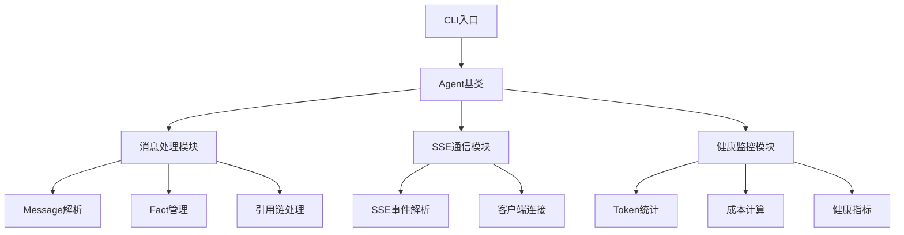

# Agent TypeScript 开发方案

**生成时间**：2026-02-11
**版本**：v1.0
**依据**：Python版Agent架构 + TS_STRUCTURE.md

---

## 一、核心设计原则

### 1.1 架构原则

| 原则 | 说明 | 实现方式 |
|------|------|----------|
| **类型安全** | 充分利用TS类型系统 | 严格模式、泛型约束、接口定义 |
| **渐进式迁移** | 从Python到TS平滑过渡 | 混合运行、双向兼容、逐步替换 |
| **模块解耦** | 高内聚、低耦合 | 按功能拆分、独立包管理 |
| **运行时兼容** | 支持Node.js环境 | 纯TS实现、无DOM依赖 |

### 1.2 代码风格

```typescript
// ✅ 推荐：显式类型 + 函数式
function processEvent(event: ClaudeEvent): Result<ProcessedEvent> {
  return event.type === 'message'
    ? ok(parseMessage(event))
    : err(new UnknownEventType());
}

// ❌ 避免：隐式类型 + 过程式
function processEvent(event) {
  if (event.type == 'message') { ... }
}
```

---

## 二、核心类型定义

### 2.1 事件类型体系

```typescript
// === 事件类型 ===

type EventType = 'message' | 'system' | 'raw' | 'error';

interface BaseEvent {
  uuid: string;
  timestamp: number;
  session_id: string;
}

interface MessageEvent extends BaseEvent {
  type: 'message';
  content: string;
  sender: 'user' | 'assistant' | 'system';
  topics?: string[];
  reply_to?: string;
}

interface SystemEvent extends BaseEvent {
  type: 'system';
  sub_type: 'status' | 'compact_boundary' | 'agent_control';
  status?: string;
  compact_metadata?: {
    trigger: 'auto' | 'manual';
    pre_tokens: number;
  };
}

interface RawEvent extends BaseEvent {
  type: 'raw';
  raw_content: string;
}

type ClaudeEvent = MessageEvent | SystemEvent | RawEvent;
```

### 2.2 消息类型体系

```typescript
// === Fact 消息 ===

interface Fact {
  fact_id: string;
  content: string;
  source: 'human' | 'agent';
  meta: {
    sender: string;
    topics: string[];
    reply_to?: string;
  };
  timestamp: number;
}

// === 消息引用链 ===

interface FactRefChain {
  chain: string[];
  depth: number;
  root_id?: string;
}

// === 消息队列 ===

interface MessageQueue {
  facts: Map<string, Fact>;
  pending: string[];
  processed: Set<string>;
}
```

### 2.3 健康指标类型

```typescript
// === Claude 使用统计 ===

interface ClaudeUsage {
  total_tokens: number;
  input_tokens: number;
  output_tokens: number;
  total_cost_rmb: number;
  cache_hit_rate: number;
}

// === Claude 健康指标 ===

interface ClaudeHealth {
  // 时之度量
  physical_age_days: number;
  psychological_age_days: number;
  cognitive_density: number;  // 心理年龄/物理年龄

  // 空之度量
  memory_size_kb: number;
  file_count: number;

  // 运行时
  total_turns: number;
  total_reasoning_count: number;
  average_turn_duration_ms: number;

  // 成本效率
  usage: ClaudeUsage;
}
```

### 2.4 状态持久化

```typescript
// === Agent 状态 ===

interface AgentState {
  // 标识
  agent_id: string;
  session_id: string;

  // 运行状态
  status: 'idle' | 'running' | 'paused' | 'stopped';
  start_time: number;
  last_active_time: number;

  // 健康指标
  health: ClaudeHealth;

  // 消息状态
  message_queue: MessageQueue;
  last_processed_id?: string;
}

// === 持久化接口 ===

interface StateStore {
  save(state: AgentState): Promise<void>;
  load(): Promise<AgentState | null>;
  clear(): Promise<void>;
}
```

---

## 三、模块架构

### 3.1 目录结构

```
agents/ts/
├── src/
│   ├── index.ts              # 主入口（聚合导出）
│   │
│   ├── core/                 # ⭐ 核心类型与逻辑
│   │   ├── index.ts
│   │   ├── types.ts          # 通用类型定义
│   │   ├── ClaudeEvent.ts    # 事件解析
│   │   ├── ClaudeUsage.ts    # Token/成本统计
│   │   ├── ClaudeHealth.ts   # 健康指标追踪
│   │   └── State.ts          # 持久化状态
│   │
│   ├── util/                 # 工具函数
│   │   ├── index.ts
│   │   ├── extract.ts        # Generator 返回值提取 ⭐
│   │   ├── JsonData.ts      # JSON 序列化
│   │   └── helpers.ts        # 杂项工具
│   │
│   ├── async/                # 异步工具
│   │   ├── index.ts
│   │   ├── syncToAsync.ts   # 同步→异步适配器
│   │   ├── ThreadPool.ts    # 线程池
│   │   └── EventEmitter.ts  # 事件总线
│   │
│   ├── messenger/            # 消息处理
│   │   ├── index.ts
│   │   ├── Message.ts
│   │   ├── Fact.ts
│   │   ├── FactRefChain.ts
│   │   └── MessengerAgent.ts
│   │
│   ├── sse/                 # SSE 通信
│   │   ├── index.ts
│   │   ├── SSEEvent.ts
│   │   ├── SSEClient.ts
│   │   └── SSEAgent.ts
│   │
│   └── cli/                  # 命令行
│       ├── index.ts
│       ├── ClaudeClient.ts
│       └── Agent.ts
│
├── test/                    # 测试文件（与 src 一一对应）
│   ├── core/
│   ├── util/
│   ├── async/
│   ├── messenger/
│   └── sse/
│
├── package.json
├── tsconfig.json
├── vite.config.ts
└── tsconfig.node.json
```

### 3.2 核心模块关系



---

## 四、开发阶段规划

### 4.1 阶段一：基础骨架（Week 1）

**目标**：搭建TS项目结构，实现核心类型

| 任务 | 产出 | 依赖 |
|------|------|------|
| 初始化项目 | `package.json`, `tsconfig.json` | - |
| 核心类型定义 | `core/types.ts`, `core/ClaudeEvent.ts` | - |
| JSON序列化 | `util/JsonData.ts` | - |
| 工具函数 | `util/helpers.ts` | - |
| 单元测试 | `test/core/*.test.ts` | 核心类型 |

**里程碑**：通过所有单元测试

### 4.2 阶段二：核心功能（Week 2）

**目标**：实现事件处理、消息队列

| 任务 | 产出 | 依赖 |
|------|------|------|
| 消息处理模块 | `messenger/Message.ts`, `Fact.ts` | 阶段一 |
| 引用链管理 | `messenger/FactRefChain.ts` | Fact |
| 健康指标计算 | `core/ClaudeUsage.ts`, `ClaudeHealth.ts` | 类型定义 |
| 状态持久化 | `core/State.ts`, `StateStore` | JSON序列化 |
| 集成测试 | `test/messenger/*.test.ts` | 消息模块 |

**里程碑**：健康指标计算误差 < 1%

### 4.3 阶段三：通信模块（Week 3）

**目标**：实现SSE通信、CLI调用

| 任务 | 产出 | 依赖 |
|------|------|------|
| SSE事件解析 | `sse/SSEEvent.ts` | ClaudeEvent |
| SSE客户端 | `sse/SSEClient.ts` | SSEEvent, EventEmitter |
| CLI客户端 | `cli/ClaudeClient.ts` | - |
| Agent基类 | `cli/Agent.ts` | 消息模块, SSE模块 |
| 端到端测试 | `test/sse/*.test.ts` | SSE模块 |

**里程碑**：支持真实SSE流式通信

### 4.4 阶段四：工具增强（Week 4）

**目标**：异步工具、性能优化

| 任务 | 产出 | 依赖 |
|------|------|------|
| 线程池 | `async/ThreadPool.ts` | - |
| 事件总线 | `async/EventEmitter.ts` | - |
| Generator提取 | `util/extract.ts` | Python兼容 |
| 性能测试 | `scripts/bench.sh` | 所有模块 |

**里程碑**：吞吐量达到Python版90%

---

## 五、Python兼容性方案

### 5.1 Generator返回值提取

Python版核心功能是处理Generator返回：

```python
# Python 实现
def process():
    yield {"type": "message", "content": "Hello"}
    yield {"type": "message", "content": "World"}

# TS 需要兼容
async function* process(): AsyncGenerator<Message> {
  yield { type: 'message', content: 'Hello' };
  yield { type: 'message', content: 'World' };
}
```

### 5.2 类型映射表

| Python 类型 | TypeScript 类型 |
|-------------|------------------|
| `dict` | `interface` / `Record<string, T>` |
| `list` | `T[]` |
| `Optional[T]` | `T \| null \| undefined` |
| `Generator[T]` | `AsyncGenerator<T>` |
| `@dataclass` | `class` + `Partial<T>` |

### 5.3 兼容层实现

```typescript
// === 同步→异步适配器 ===

class SyncToAsyncAdapter {
  private pythonGenerator: PythonGenerator;

  constructor(pyModule: any) {
    this.pythonGenerator = pyModule.main;
  }

  async *execute(): AsyncGenerator<unknown> {
    const gen = this.pythonGenerator();
    while (true) {
      const result = gen.send(undefined);
      if (result.done) break;
      yield result.value;
    }
  }
}
```

---

## 六、测试策略

### 6.1 测试覆盖目标

| 层级 | 覆盖率要求 | 工具 |
|------|-----------|------|
| 单元测试 | ≥ 80% | Vitest |
| 集成测试 | ≥ 60% | Vitest + Mock |
| 端到端 | ≥ 40% | Playwright |

### 6.2 测试用例示例

```typescript
// === ClaudeEvent.test.ts ===

describe('ClaudeEvent', () => {
  it('should parse message event', () => {
    const event = new ClaudeEvent({
      type: 'message',
      content: 'Hello',
      uuid: 'test-uuid',
      timestamp: Date.now(),
      session_id: 'session-123'
    });

    expect(event.type).toBe('message');
    expect(event.content).toBe('Hello');
  });

  it('should handle raw event', () => {
    const raw = 'Error: something went wrong';
    const event = new ClaudeEvent(raw);

    expect(event.type).toBe('raw');
    expect(event.raw_content).toBe(raw);
  });
});
```

---

## 七、构建与部署

### 7.1 npm 脚本

```json
{
  "scripts": {
    "dev": "vite",
    "build": "tsc && vite build",
    "test": "vitest run",
    "test:ui": "vitest --ui",
    "lint": "eslint src --ext .ts",
    "typecheck": "tsc --noEmit"
  }
}
```

### 7.2 依赖管理

```json
{
  "dependencies": {
    "typescript": "^5.3.0",
    "vitest": "^1.0.0"
  },
  "devDependencies": {
    "@types/node": "^20.10.0",
    "eslint": "^8.55.0"
  }
}
```

---

## 八、风险与对策

| 风险 | 影响 | 对策 |
|------|------|------|
| 类型定义不完整 | 运行时错误 | 增量式开发，先有测试后有实现 |
| Python兼容性问题 | 功能缺失 | 保留Python版作为fallback |
| 性能差距 | 吞吐量不足 | 性能测试先行，Profiling定位瓶颈 |
| 学习曲线 | 开发效率低 | 完善文档，TypeScript最佳实践指南 |

---

## 九、验收标准

### 9.1 功能验收

- [ ] 核心类型定义完整（ClaudeEvent, Fact, ClaudeHealth）
- [ ] 消息处理模块支持Fact创建、引用链管理
- [ ] 健康指标计算误差 < 1%
- [ ] SSE通信支持断线重连
- [ ] 状态持久化支持JSON文件

### 9.2 质量验收

- [ ] 单元测试覆盖率 ≥ 80%
- [ ] 无类型错误（`tsc --noEmit`）
- [ ] ESLint通过
- [ ] 构建产物可用（`npm run build`）

---

## 十、下一步行动

1. **立即执行**：创建项目骨架，初始化 `package.json`
2. **本周完成**：核心类型定义（`core/types.ts`）
3. **本周完成**：首个单元测试（`ClaudeEvent.test.ts`）

---

**报告生成时间**：2026-02-11
**数据来源**：Python版Agent架构 + TS_STRUCTURE.md
**版本**：v1.0
