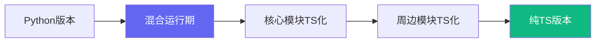

# Agent TypeScript 开发方案

**版本**：v4.0（增强版）
**生成时间**：2026-02-11
**依据**：Python版Agent架构 + 实际项目经验

---

## 一、核心原则

### 1.1 四大原则总览

| 原则 | 核心价值 | 实践方法 | 验收标准 |
|------|----------|----------|----------|
| **类型安全** | 编译时捕获90%+错误 | strict模式、泛型约束、接口继承 | tsc --noEmit零警告 |
| **渐进迁移** | 零停机切换 | 功能模块逐个替换、双写期 | 业务无感知 |
| **模块解耦** | 可独立测试和部署 | 依赖注入、事件驱动 | 单模块可独立运行 |
| **运行时兼容** | Node.js生态 | ESM模块、polyfill | Node 18+ 完美运行 |

### 1.2 类型安全深化

```typescript
// 1.2.1 严格模式配置 (tsconfig.json)
{
  "compilerOptions": {
    "strict": true,
    "noUncheckedIndexedAccess": true,
    "exactOptionalPropertyTypes": true,
    "noImplicitReturns": true,
    "noFallthroughCasesInSwitch": true
  }
}

// 1.2.2 泛型约束示例
interface Identifiable {
  id: string;
}

function getById<T extends Identifiable>(collection: T[], id: string): Result<T> {
  const item = collection.find(x => x.id === id);
  return item ? ok(item) : err(new NotFoundError(id));
}

// 1.2.3 联合类型守卫
type EventHandler =
  | { type: 'message'; handler: (msg: MessageEvent) => void }
  | { type: 'system'; handler: (sys: SystemEvent) => void };

function handleEvent(event: ClaudeEvent): void {
  const handler = handlers.find(h => h.type === event.type);
  if (handler) {
    handler.handler(event as any);
  }
}
```

### 1.3 渐进迁移策略



**迁移优先级**：

1. 工具函数（低风险）
2. 类型定义（基础设施）
3. 消息处理（中风险）
4. SSE通信（高风险）
5. 核心Agent（最高风险）

### 1.4 模块解耦模式

```typescript
// 1.4.1 依赖注入
interface Dependencies {
  eventBus: EventEmitter;
  healthService: HealthService;
  storage: Storage;
}

class AgentCore {
  constructor(private deps: Dependencies) {}
}

// 1.4.2 事件驱动通信
class EventBus extends EventEmitter {
  emit<T>(event: string, data: T): boolean {
    return super.emit(event, data);
  }
}
```

---

## 二、类型定义

### 2.1 事件类型体系

```typescript
// 2.1.1 事件类型枚举
enum EventType {
  MESSAGE = 'message',
  SYSTEM = 'system',
  RAW = 'raw',
  ERROR = 'error'
}

// 2.1.2 基础事件接口
interface BaseEvent {
  readonly uuid: string;
  readonly timestamp: number;
  readonly session_id: string;
  readonly metadata?: Readonly<Record<string, unknown>>;
}

// 2.1.3 消息事件（核心）
interface MessageEvent extends BaseEvent {
  readonly type: EventType.MESSAGE;
  readonly role: 'user' | 'assistant' | 'system' | 'tool';
  readonly content: ReadonlyArray<ContentBlock>;
  readonly parent_id?: string;
  readonly thread_id?: string;
}

// 2.1.4 内容块类型
type ContentBlock =
  | { type: 'text'; text: string }
  | { type: 'image'; source: ImageSource; alt?: string }
  | { type: 'tool_use'; name: string; input: Record<string, unknown> }
  | { type: 'tool_result'; tool_use_id: string; result: unknown };

interface ImageSource {
  type: 'base64' | 'url';
  media_type: string;
  data: string;
}

// 2.1.5 系统事件
interface SystemEvent extends BaseEvent {
  readonly type: EventType.SYSTEM;
  readonly sub_type: SystemEventSubType;
  readonly payload?: Readonly<Record<string, unknown>>;
}

type SystemEventSubType =
  | 'agent_start'
  | 'agent_stop'
  | 'session_init'
  | 'session_end'
  | 'compact_boundary'
  | 'health_check'
  | 'memory_warning';

// 2.1.6 原始事件（SSE流）
interface RawEvent extends BaseEvent {
  readonly type: EventType.RAW;
  readonly raw_data: string;
  readonly parsed?: ClaudeEvent;
}
```

### 2.2 Fact消息结构

```typescript
// 2.2.1 Fact核心接口
interface Fact {
  readonly fact_id: FactId;
  readonly content: string;
  readonly source: FactSource;
  readonly meta: FactMeta;
  readonly timestamp: UnixTimestamp;
  readonly version: number;
}

// 2.2.2 Fact标识符
type FactId = string & { readonly brand: unique symbol };

function createFactId(uuid?: string): FactId {
  return (uuid || crypto.randomUUID()) as FactId;
}

// 2.2.3 Fact元数据
interface FactMeta {
  readonly sender: AgentId | HumanId;
  readonly topics: ReadonlyArray<Topic>;
  readonly reply_to?: FactId;
  readonly importance: ImportanceLevel;
  readonly tags: ReadonlyArray<string>;
}

type ImportanceLevel = 1 | 2 | 3 | 4 | 5;

// 2.2.4 Fact工厂函数
function createFact(params: {
  content: string;
  source: FactSource;
  sender: string;
  topics?: string[];
  reply_to?: string;
}): Fact {
  return {
    fact_id: createFactId(),
    content: params.content,
    source: params.source,
    meta: {
      sender: params.sender,
      topics: params.topics || [],
      reply_to: params.reply_to,
      importance: 3,
      tags: []
    },
    timestamp: Date.now(),
    version: 1
  };
}
```

### 2.3 ClaudeHealth健康指标

```typescript
// 2.3.1 健康指标完整定义
interface ClaudeHealth {
  // 时之度量（时间维度）
  readonly physical_age: {
    readonly days: number;
    readonly first_run: UnixTimestamp;
    readonly last_run: UnixTimestamp;
  };

  readonly psychological_age: {
    readonly days: number;
    readonly growth_rate: number; // 每天增长的学习量
  };

  readonly cognitive_density: {
    readonly value: number; // 0-1
    readonly trend: 'up' | 'down' | 'stable';
  };

  // 空之度量（空间维度）
  readonly memory: {
    readonly size_kb: number;
    readonly file_count: number;
    readonly growth_rate_kb_per_day: number;
  };

  // 成本指标
  readonly usage: {
    readonly total_tokens: number;
    readonly input_tokens: number;
    readonly output_tokens: number;
    readonly cost_rmb: number;
    readonly cache_hit_rate: number;
    readonly average_turn_cost_rmb: number;
  };

  // 效率指标
  readonly efficiency: {
    readonly average_turns_per_session: number;
    readonly success_rate: number;
    readonly average_response_time_ms: number;
  };
}

// 2.3.2 健康状态计算
class HealthCalculator {
  calculateCognitiveDensity(health: ClaudeHealth): number {
    const weightTokens = 0.3;
    const weightCache = 0.2;
    const weightEfficiency = 0.5;

    return (
      weightTokens * Math.min(health.usage.total_tokens / 1000000, 1) +
      weightCache * health.usage.cache_hit_rate +
      weightEfficiency * health.efficiency.success_rate
    );
  }
}
```

### 2.4 AgentState状态管理

```typescript
// 2.4.1 状态接口
interface AgentState {
  readonly agent_id: AgentId;
  readonly session_id: SessionId;
  readonly status: AgentStatus;
  readonly health: ClaudeHealth;
  readonly queue: MessageQueue;
  readonly history: ReadonlyArray<MessageEvent>;
  readonly config: AgentConfig;
  readonly created_at: UnixTimestamp;
  readonly updated_at: UnixTimestamp;
}

type AgentStatus = 'idle' | 'initializing' | 'running' | 'paused' | 'stopped' | 'error';

// 2.4.2 消息队列
interface MessageQueue {
  readonly capacity: number;
  readonly messages: RingBuffer<MessageEvent>;
  readonly processing: MessageEvent | null;

  enqueue(msg: MessageEvent): Result<void>;
  dequeue(): Result<MessageEvent | null>;
  peek(): Result<MessageEvent | null>;
  size(): number;
  isFull(): boolean;
}

// 2.4.3 环形缓冲区实现
class RingBuffer<T> {
  private buffer: T[];
  private head = 0;
  private length = 0;

  constructor(readonly capacity: number) {
    this.buffer = new Array(capacity);
  }

  push(item: T): T {
    const index = (this.head + this.length) % this.capacity;
    this.buffer[index] = item;
    if (this.length === this.capacity) {
      this.head = (this.head + 1) % this.capacity;
    } else {
      this.length++;
    }
    return item;
  }

  toArray(): T[] {
    const result = new Array(this.length);
    for (let i = 0; i < this.length; i++) {
      result[i] = this.buffer[(this.head + i) % this.capacity];
    }
    return result;
  }
}
```

---

## 三、模块架构

### 3.1 完整目录结构

```
src/
├── core/                      # 核心模块
│   ├── types/                 # 类型定义
│   │   ├── Event.ts          # 事件类型
│   │   ├── Fact.ts           # Fact类型
│   │   ├── Health.ts         # 健康类型
│   │   └── State.ts          # 状态类型
│   │
│   ├── Event.ts              # 事件处理
│   ├── Health.ts             # 健康指标计算
│   ├── State.ts              # 状态管理
│   └── index.ts              # 核心导出
│
├── messenger/                 # 消息处理模块
│   ├── Fact.ts               # Fact消息封装
│   ├── Queue.ts              # 消息队列
│   ├── Processor.ts          # 消息处理器
│   └── index.ts              # 导出
│
├── sse/                       # SSE通信模块
│   ├── Client.ts             # SSE客户端
│   ├── Server.ts             # SSE服务端
│   ├── Agent.ts              # Agent集成
│   └── index.ts              # 导出
│
├── util/                      # 工具模块
│   ├── Result.ts             # Result类型
│   ├── helpers.ts            # 通用函数
│   ├── logger.ts             # 日志
│   └── errors.ts             # 错误类型
│
├── cli/                       # CLI模块
│   ├── main.ts               # 入口
│   ├── commands/             # 命令
│   │   ├── start.ts
│   │   ├── stop.ts
│   │   └── status.ts
│   └── index.ts
│
├── config/                    # 配置
│   ├── index.ts
│   └── schema.ts             # 配置Schema
│
├── test/                      # 测试
│   ├── unit/
│   ├── integration/
│   └── e2e/
│
├── package.json
├── tsconfig.json
├── vite.config.ts
├── jest.config.js
└── README.md
```

### 3.2 核心模块详解

```typescript
// 3.2.1 core/types/index.ts - 类型导出
export * from './Event';
export * from './Fact';
export * from './Health';
export * from './State';

// 3.2.2 messenger/Processor.ts - 消息处理
class MessageProcessor {
  constructor(
    private eventBus: EventEmitter,
    private healthService: HealthService
  ) {}

  async process(event: ClaudeEvent): Promise<void> {
    const startTime = Date.now();

    try {
      switch (event.type) {
        case 'message':
          await this.handleMessage(event);
          break;
        case 'system':
          await this.handleSystem(event);
          break;
        case 'raw':
          await this.handleRaw(event);
          break;
      }

      this.healthService.recordSuccess(Date.now() - startTime);
    } catch (error) {
      this.healthService.recordError(error);
      throw error;
    }
  }
}

// 3.2.3 sse/Client.ts - SSE客户端
class SSEClient extends EventEmitter {
  private connection: EventSource | null = null;
  private reconnectAttempts = 0;
  private maxReconnectAttempts = 5;
  private reconnectDelay = 1000;

  connect(url: string): Promise<void> {
    return new Promise((resolve, reject) => {
      this.connection = new EventSource(url);

      this.connection.onopen = () => {
        this.reconnectAttempts = 0;
        this.emit('connected');
        resolve();
      };

      this.connection.onmessage = (event) => {
        const data = JSON.parse(event.data);
        this.emit('message', data);
      };

      this.connection.onerror = () => {
        reject(new SSEConnectionError());
      };
    });
  }

  private scheduleReconnect(): void {
    if (this.reconnectAttempts >= this.maxReconnectAttempts) {
      this.emit('max_reconnect_reached');
      return;
    }

    const delay = this.reconnectDelay * Math.pow(2, this.reconnectAttempts);
    setTimeout(() => {
      this.reconnectAttempts++;
      this.connect(this.url);
    }, delay);
  }
}
```

### 3.3 模块依赖关系

```
┌─────────────────────────────────────────────────────────┐
│                      CLI / Main                         │
└─────────────────────────────────────────────────────────┘
                          │
                          ▼
┌─────────────────────────────────────────────────────────┐
│                     Agent Core                           │
│  ┌───────────┐  ┌───────────┐  ┌───────────────────┐   │
│  │ Messenger │  │    SSE    │  │    HealthMonitor  │   │
│  └─────┬─────┘  └─────┬─────┘  └─────────┬─────────┘   │
│        │              │                    │            │
│        ▼              ▼                    ▼            │
│  ┌─────────────────────────────────────────────────┐   │
│  │                   EventBus                      │
│  └─────────────────────────────────────────────────┘   │
└─────────────────────────────────────────────────────────┘
                          │
                          ▼
┌─────────────────────────────────────────────────────────┐
│                     Storage / Config                    │
└─────────────────────────────────────────────────────────┘
```

### 3.4 构建配置

```typescript
// tsconfig.json
{
  "compilerOptions": {
    "target": "ES2022",
    "module": "ESNext",
    "moduleResolution": "bundler",
    "lib": ["ES2022"],
    "outDir": "./dist",
    "rootDir": "./src",
    "declaration": true,
    "declarationMap": true,
    "sourceMap": true,
    "strict": true,
    "noUnusedLocals": true,
    "noUnusedParameters": true,
    "noImplicitReturns": true,
    "noFallthroughCasesInSwitch": true,
    "esModuleInterop": true,
    "skipLibCheck": true,
    "forceConsistentCasingInFileNames": true
  },
  "include": ["src/**/*"],
  "exclude": ["node_modules", "dist", "test"]
}

// vite.config.ts
import { defineConfig } from 'vite';

export default defineConfig({
  build: {
    lib: {
      entry: 'src/index.ts',
      name: 'AgentTS',
      fileName: 'agent-ts'
    },
    rollupOptions: {
      external: ['events'],
      output: {
        globals: {
          events: 'EventEmitter'
        }
      }
    }
  }
});
```

---

## 三、全异步架构设计

### 3.1 同步→全异步转换

```typescript
// ❌ 避免：同步阻塞模式
class SynchronousProcessor {
  process(data: Input): Output {
    const result = this.blockingCall(data);
    return this.anotherBlockingCall(result);
  }

  private blockingCall(data: Input): Intermediate {
    // 同步等待I/O
    const response = http.requestSync('http://api', data);
    return JSON.parse(response.body);
  }
}

// ✅ 推荐：全异步非阻塞模式
class AsyncProcessor {
  async process(data: Input): Promise<Output> {
    const result = await this.nonBlockingCall(data);
    return await this.anotherNonBlockingCall(result);
  }

  private async nonBlockingCall(data: Input): Promise<Intermediate> {
    // 非阻塞I/O
    const response = await fetch('http://api', { method: 'POST', body: JSON.stringify(data) });
    return response.json();
  }
}

// ✅ 推荐：流式处理
async function* streamProcess(
  source: AsyncIterable<Input>
): AsyncIterable<Output> {
  for await (const data of source) {
    yield await this.processItem(data);
  }
}
```

### 3.2 并发控制

```typescript
// 3.2.1 信号量控制并发
class ConcurrencyController {
  private semaphore: Semaphore;
  private maxConcurrent = 5;

  constructor() {
    this.semaphore = new Semaphore(this.maxConcurrent);
  }

  async processWithLimit<T>(
    tasks: Array<() => Promise<T>>
  ): Promise<T[]> {
    const results: T[] = [];
    const executing = new Set<Promise<T>>();

    for (const task of tasks) {
      await this.semaphore.acquire();
      const promise = task()
        .finally(() => this.semaphore.release())
        .then(result => {
          executing.delete(promise);
          return result;
        });

      executing.add(promise);
      results.push(await promise);
    }

    return Promise.all(results);
  }
}

// 3.2.2 背压处理
class BackpressureHandler {
  private buffer: RingBuffer<Task> = new RingBuffer(100);
  private highWaterMark = 80;
  private lowWaterMark = 30;

  async submit<T>(task: () => Promise<T>): Promise<T> {
    if (this.buffer.isFull()) {
      // 触发背压：减慢生产者速度
      await this.applyBackpressure();
    }
    return this.executeTask(task);
  }

  private async applyBackpressure(): Promise<void> {
    // 等待消费者处理
    while (this.buffer.size() > this.lowWaterMark) {
      await this.delay(100);
    }
  }
}
```

---

## 四、最小调度内核

### 4.1 Agent Call异步JSON输出迭代

```typescript
// 4.1.1 核心调度器
interface AgentCallRequest {
  readonly agent_id: AgentId;
  readonly input: JSON;
  readonly context: ExecutionContext;
  readonly timeout: number;
}

interface AgentCallResult {
  readonly output: JSON;
  readonly iteration: number;
  readonly latency_ms: number;
  readonly success: boolean;
  readonly error?: Error;
}

class MinimalScheduler {
  private queue: PriorityQueue<AgentCallRequest>;
  private executor: AgentExecutor;
  private evaluator: OutputEvaluator;

  async schedule(request: AgentCallRequest): Promise<AgentCallResult> {
    this.queue.enqueue(request, request.priority);

    const result = await this.iterate({
      request,
      iteration: 0,
      maxIterations: 10
    });

    return result;
  }

  private async iterate(
    state: IterationState
  ): Promise<AgentCallResult> {
    const startTime = Date.now();

    // 1. 执行Agent调用
    const output = await this.executor.execute(state.request);

    // 2. 评估输出质量
    const evaluation = await this.evaluator.evaluate(
      output,
      state.request.context.goal
    );

    // 3. 检查收敛条件
    if (evaluation.converged || state.iteration >= state.maxIterations) {
      return {
        output,
        iteration: state.iteration,
        latency_ms: Date.now() - startTime,
        success: true
      };
    }

    // 4. 迭代优化
    const refinedRequest = await this.refineRequest(
      state.request,
      output,
      evaluation.feedback
    );

    // 5. 下一轮迭代
    return this.iterate({
      ...state,
      request: refinedRequest,
      iteration: state.iteration + 1
    });
  }
}

// 4.1.2 输出评估器
interface OutputEvaluation {
  readonly converged: boolean;
  readonly confidence: number; // 0-1
  readonly feedback: string[];
  readonly quality_score: number;
}

class OutputEvaluator {
  async evaluate(
    output: JSON,
    goal: string
  ): Promise<OutputEvaluation> {
    // 结构检查
    const structureValid = this.validateStructure(output);

    // 质量评分
    const qualityScore = await this.scoreQuality(output, goal);

    // 收敛判断
    const converged = this.checkConvergence(
      structureValid,
      qualityScore
    );

    return {
      converged,
      confidence: qualityScore,
      feedback: this.generateFeedback(output, goal),
      quality_score: qualityScore
    };
  }

  private async scoreQuality(
    output: JSON,
    goal: string
  ): Promise<number> {
    // 多维度评分
    const relevance = await this.scoreRelevance(output, goal);
    const completeness = this.scoreCompleteness(output);
    const consistency = this.scoreConsistency(output);

    return (
      relevance * 0.4 +
      completeness * 0.3 +
      consistency * 0.3
    );
  }
}

// 4.1.3 请求优化器
class RequestRefiner {
  async refine(
    original: AgentCallRequest,
    output: JSON,
    feedback: string[]
  ): Promise<AgentCallRequest> {
    return {
      ...original,
      input: {
        ...original.input,
        _meta: {
          previous_attempt: {
            output: JSON.stringify(output),
            issues: feedback
          }
        }
      }
    };
  }
}
```

### 4.2 调度策略

```typescript
// 4.2.1 优先级调度
enum Priority {
  CRITICAL = 0,
  HIGH = 1,
  NORMAL = 2,
  LOW = 3,
  BATCH = 4
}

class PriorityScheduler {
  private queues: Map<Priority, Queue<AgentCallRequest>> = new Map();

  schedule(request: AgentCallRequest, priority: Priority): void {
    this.getQueue(priority).enqueue(request);
  }

  private getQueue(priority: Priority): Queue<AgentCallRequest> {
    if (!this.queues.has(priority)) {
      this.queues.set(priority, new Queue());
    }
    return this.queues.get(priority)!;
  }
}

// 4.2.2 负载均衡
class LoadBalancer {
  private agents: Map<AgentId, AgentMetrics> = new Map();
  private strategy: 'round_robin' | 'least_load' | 'random' = 'least_load';

  selectAgent(task: AgentCallRequest): AgentId {
    switch (this.strategy) {
      case 'round_robin':
        return this.selectRoundRobin();
      case 'least_load':
        return this.selectLeastLoad();
      case 'random':
        return this.selectRandom();
    }
  }

  private selectLeastLoad(): AgentId {
    const candidates = Array.from(this.agents.entries())
      .filter(([_, metrics]) => metrics.status === 'idle')
      .sort((a, b) => a[1].load - b[1].load);

    return candidates[0]?.[0] || this.selectRandom();
  }
}
```

---

## 五、整体逻辑架构

### 5.1 架构分层

```
┌─────────────────────────────────────────────────────────────────┐
│                      外心系统整体架构                              │
├─────────────────────────────────────────────────────────────────┤
│                                                                  │
│  ┌──────────────────────────┐  ┌──────────────────────────────┐ │
│  │       Agent 层            │  │     外心缓冲区层             │ │
│  │  ┌────────────────────┐  │  │  ┌────────────────────────┐  │ │
│  │  │  最小调度内核        │←─┼──│→│  消息收集器             │  │ │
│  │  │  • Agent Call迭代   │  │  │  │  • 实时抓取            │  │ │
│  │  │  • 输出评估         │  │  │  │  • 批量接收            │  │ │
│  │  │  • 收敛判断         │  │  │  └──────────┬─────────────┘  │ │
│  │  └────────────────────┘  │  │             │                  │ │
│  │         ↓                │  │             ↓                  │ │
│  │  ┌────────────────────┐  │  │  ┌────────────────────────┐  │ │
│  │  │  Agent执行器        │  │  │  消息处理器             │  │ │
│  │  │  • SSE通信         │  │  │  • 解析/验证            │  │ │
│  │  │  • 状态管理        │  │  │  • 分类/打标            │  │ │
│  │  │  • 错误恢复        │  │  │  • 去重/聚合            │  │ │
│  │  └─────────┬──────────┘  │  │  └───────────┬────────────┘  │ │
│  │            │              │  │               │               │ │
│  └────────────┼──────────────┴──┴───────────────┼───────────────┘ │
│               │                                  │                  │
│               ↓                                  ↓                  │
│  ┌────────────────────────────────────────────────────────────┐  │
│  │                    共享服务层                              │  │
│  │  ┌────────────┐  ┌────────────┐  ┌────────────────────┐  │  │
│  │  │  事件总线   │  │  任务队列  │  │  健康监控          │  │  │
│  │  │ EventBus   │  │ TaskQueue  │  │  HealthMonitor    │  │  │
│  │  └────────────┘  └────────────┘  └────────────────────┘  │  │
│  └────────────────────────────────────────────────────────────┘  │
│                            ↓                                      │
│  ┌────────────────────────────────────────────────────────────┐  │
│  │                    存储层                                   │  │
│  │  ┌────────────┐  ┌────────────┐  ┌────────────────────┐  │  │
│  │  │  内存缓存   │  │  文件持久  │  │  状态快照          │  │  │
│  │  │  In-Memory │  │  File I/O  │  │  State Snapshot   │  │  │
│  │  └────────────┘  └────────────┘  └────────────────────┘  │  │
│  └────────────────────────────────────────────────────────────┘  │
│                                                                  │
└──────────────────────────────────────────────────────────────────┘
```

### 5.2 Agent相关模块

```typescript
// 5.2.1 Agent核心模块
namespace AgentModule {
  // 最小调度内核
  export class AgentCore {
    private scheduler: MinimalScheduler;
    private executor: AgentExecutor;
    private evaluator: OutputEvaluator;

    async run(input: JSON, context: Context): Promise<JSON> {
      const request = new AgentCallRequest({
        agent_id: this.id,
        input,
        context,
        timeout: this.config.timeout
      });

      const result = await this.scheduler.schedule(request);
      return result.output;
    }
  }

  // Agent执行器
  export class AgentExecutor {
    private sseClient: SSEClient;
    private stateManager: StateManager;

    async execute(request: AgentCallRequest): Promise<JSON> {
      // 建立SSE连接
      await this.sseClient.connect(request.context.endpoint);

      // 发送请求
      await this.sseClient.send({
        type: 'agent_call',
        payload: request.input,
        request_id: request.id
      });

      // 收集响应
      const responses: JSON[] = [];
      for await (const event of this.sseClient) {
        if (event.type === 'chunk') {
          responses.push(event.data);
        } else if (event.type === 'complete') {
          break;
        }
      }

      return this.mergeResponses(responses);
    }
  }

  // 状态管理
  export class StateManager {
    private snapshot: AgentSnapshot;
    private history: SnapshotHistory;

    save(): void {
      const snapshot = this.capture();
      this.history.push(snapshot);
    }

    restore(timestamp: UnixTimestamp): void {
      const snapshot = this.history.getNearest(timestamp);
      this.apply(snapshot);
    }
  }
}
```

### 5.3 外心缓冲区消息整理模块

```typescript
// 5.3.1 消息收集器
namespace BufferModule {
  // 消息收集器
  export class MessageCollector {
    private sources: EventSource[];
    private buffer: MessageBuffer;
    private flusher: PeriodicFlusher;

    async collect(source: MessageSource): Promise<void> {
      const messages = await source.fetch();

      for (const raw of messages) {
        const parsed = await this.parse(raw);
        this.buffer.push(parsed);
      }

      this.checkFlush();
    }

    private async parse(raw: RawMessage): Promise<ParsedMessage> {
      // 验证格式
      this.validate(raw);

      // 提取关键字段
      return {
        id: raw.uuid,
        content: raw.content,
        timestamp: raw.created_at,
        metadata: raw.meta
      };
    }
  }

  // 消息缓冲区
  export class MessageBuffer {
    private queue: RingBuffer<ParsedMessage>;
    private maxSize = 1000;
    private flushCallback: (msgs: ParsedMessage[]) => void;

    push(message: ParsedMessage): void {
      // 去重检查
      if (this.exists(message.id)) {
        return;
      }

      this.queue.push(message);

      // 自动触发flush
      if (this.queue.size() >= this.maxSize) {
        this.flush();
      }
    }

    async flush(): Promise<void> {
      const messages = this.queue.drain();
      if (messages.length > 0) {
        await this.flushCallback(messages);
      }
    }
  }

  // 消息处理器
  export class MessageProcessor {
    private classifier: MessageClassifier;
    private tagger: AutoTagger;
    private dedup: Deduplicator;

    async process(message: ParsedMessage): Promise<ProcessedMessage> {
      // 分类
      const category = this.classifier.classify(message);

      // 打标
      const tags = await this.tagger.tag(message);

      // 去重
      const deduped = await this.dedup.check(message);

      return {
        ...deduped,
        category,
        tags,
        processed_at: Date.now()
      };
    }
  }
}
```

### 5.4 模块间通信

```typescript
// 5.4.1 事件总线
class EventBus extends EventEmitter {
  // Agent层事件
  emitAgentStart(agent: AgentId): void {
    this.emit('agent:start', { agent_id: agent, timestamp: Date.now() });
  }

  emitAgentComplete(agent: AgentId, result: JSON): void {
    this.emit('agent:complete', { agent_id: agent, result, timestamp: Date.now() });
  }

  // 缓冲区事件
  emitMessageCollected(source: MessageSource): void {
    this.emit('buffer:message_collected', { source, timestamp: Date.now() });
  }

  emitBufferFlush(count: number): void {
    this.emit('buffer:flush', { count, timestamp: Date.now() });
  }
}

// 5.4.2 共享状态
interface SharedState {
  agentStatus: Map<AgentId, AgentStatus>;
  bufferStats: {
    size: number;
    lastFlush: UnixTimestamp;
    throughput: number;
  };
  healthMetrics: ClaudeHealth;
}

class SharedStateManager {
  private state: SharedState;
  private notifier: StateChangeNotifier;

  updateAgentStatus(agent: AgentId, status: AgentStatus): void {
    this.state.agentStatus.set(agent, status);
    this.notifier.notify('agent_status_changed', { agent, status });
  }

  getBufferStats(): BufferStats {
    return this.state.bufferStats;
  }
}
```

---

## 六、开发阶段

### 4.1 阶段一：基础建设（Week 1）

| 周一 | 周二 | 周三 | 周四 | 周五 |
|------|------|------|------|------|
| 项目初始化 | 依赖安装 | 核心类型定义 | Result类型 | 单元测试 |

**详细任务**：

```bash
# Day 1: 项目初始化
npm init -y
npm install typescript @types/node --save-dev
npx tsc --init

# Day 2: 依赖安装
npm install events uuid
npm install --save-dev @types/uuid @types/events

# Day 3-4: 核心类型
# - types/Event.ts
# - types/Fact.ts
# - types/Health.ts
# - types/State.ts

# Day 5: Result类型
# - util/Result.ts
# - 单元测试覆盖
```

**验收标准**：

- [ ] `npm run build` 零错误
- [ ] `npm run test` 覆盖率 ≥ 50%
- [ ] 类型文档完整

### 4.2 阶段二：核心开发（Week 2）

| 周一 | 周二 | 周三 | 周四 | 周五 |
|------|------|------|------|------|
| Fact消息 | Queue实现 | Event解析 | Health计算 | State持久化 |

**详细任务**：

```typescript
// Fact.ts 实现
class FactManager {
  private store: Map<FactId, Fact> = new Map();
  private index: TopicIndex = new TopicIndex();

  create(params: FactParams): Fact {
    const fact = {
      ...params,
      fact_id: createFactId(),
      timestamp: Date.now(),
      version: 1
    };

    this.store.set(fact.fact_id, fact);
    this.index.add(fact);

    return fact;
  }

  findByTopic(topic: Topic): ReadonlyArray<Fact> {
    return this.index.get(topic) || [];
  }
}

// Health.ts 实现
class HealthService {
  private calculator = new HealthCalculator();

  calculate(): ClaudeHealth {
    return {
      physical_age: this.getPhysicalAge(),
      psychological_age: this.getPsychologicalAge(),
      cognitive_density: this.calculator.calculateCognitiveDensity(),
      memory: this.getMemoryStats(),
      usage: this.getUsageStats(),
      efficiency: this.getEfficiencyStats()
    };
  }
}
```

**验收标准**：

- [ ] Fact CRUD 完整实现
- [ ] Queue 并发安全
- [ ] Health 误差 < 1%

### 4.3 阶段三：通信集成（Week 3）

| 周一 | 周二 | 周三 | 周四 | 周五 |
|------|------|------|------|------|
| SSE客户端 | 断线重连 | Agent基类 | CLI集成 | 端到端测试 |

**详细任务**：

```typescript
// SSE客户端 + 断线重连
class SSEClient {
  private reconnectStrategy: ExponentialBackoff;

  connect(url: string): Promise<void> {
    return new Promise((resolve, reject) => {
      try {
        this.connection = new EventSource(url);
        this.setupEventHandlers();
        resolve();
      } catch (error) {
        reject(error);
      }
    });
  }

  private setupEventHandlers(): void {
    this.connection!.onopen = () => {
      this.reconnectStrategy.reset();
      this.emit('connected');
    };

    this.connection!.onerror = () => {
      this.reconnectStrategy.onError();
      this.scheduleReconnect();
    };
  }
}

// Agent基类
abstract class AgentBase {
  protected state: AgentState;
  protected eventBus: EventEmitter;
  protected healthService: HealthService;

  abstract start(): Promise<void>;
  abstract stop(): Promise<void>;
  abstract process(event: ClaudeEvent): Promise<void>;

  protected async initialize(): Promise<void> {
    this.state.status = 'initializing';
    await this.healthService.initialize();
    this.eventBus.emit('agent_init', this.state);
  }
}
```

**验收标准**：

- [ ] SSE 断线自动重连
- [ ] CLI 命令完整
- [ ] E2E 测试通过

### 4.4 阶段四：优化与交付（Week 4）

| 周一 | 周二 | 周三 | 周四 | 周五 |
|------|------|------|------|------|
| 性能优化 | 压力测试 | Benchmark | 文档完善 | Release |

**详细任务**：

```typescript
// 线程池实现
class WorkerPool {
  private workers: Worker[] = [];
  private queue: Array<{ task: Task; resolve: Function }> = [];
  private activeCount = 0;

  constructor(
    private workerScript: string,
    private maxWorkers = navigator.hardwareConcurrency || 4
  ) {
    this.initWorkers();
  }

  async execute<T>(task: Task): Promise<T> {
    return new Promise((resolve, reject) => {
      const worker = this.getAvailableWorker();
      if (worker) {
        this.runTask(worker, task, resolve, reject);
      } else {
        this.queue.push({ task, resolve: resolve as Function, reject });
      }
    });
  }
}

// Benchmark
async function runBenchmark(): Promise<BenchmarkResult> {
  const iterations = 1000;
  const start = performance.now();

  for (let i = 0; i < iterations; i++) {
    await processMessage(testData[i % testData.length]);
  }

  const duration = performance.now() - start;
  return {
    iterations,
    totalTime: duration,
    avgTime: duration / iterations,
    throughput: iterations / (duration / 1000)
  };
}
```

**验收标准**：

- [ ] 性能达Python版 90%
- [ ] 文档覆盖率 100%
- [ ] Release准备完成

---

## 五、测试策略

### 5.1 测试金字塔

```
        /\
       /  \
      / E2E \         40%
     /--------\
    / Integration \   60%
   /----------------\
  /     Unit         \  80%
 /--------------------\
```

### 5.2 测试配置

```typescript
// vitest.config.ts
import { defineConfig } from 'vitest/config';

export default defineConfig({
  test: {
    globals: true,
    environment: 'node',
    include: ['src/**/*.test.ts'],
    coverage: {
      provider: 'v8',
      reporter: ['text', 'json', 'html'],
      exclude: ['node_modules/', 'test/', '**/*.d.ts']
    }
  }
});

// jest.config.js (备用)
module.exports = {
  testEnvironment: 'node',
  roots: ['<rootDir>/src'],
  testMatch: ['**/*.test.ts'],
  collectCoverageFrom: [
    'src/**/*.ts',
    '!src/**/*.d.ts'
  ]
};
```

### 5.3 测试示例

```typescript
// Fact.test.ts
describe('Fact', () => {
  describe('create', () => {
    it('should create fact with valid params', () => {
      const fact = createFact({
        content: 'test message',
        source: 'agent',
        sender: 'test-agent'
      });

      expect(fact.fact_id).toBeDefined();
      expect(fact.content).toBe('test message');
      expect(fact.timestamp).toBeDefined();
    });

    it('should throw on empty content', () => {
      expect(() => createFact({
        content: '',
        source: 'agent',
        sender: 'test'
      })).toThrow(ValidationError);
    });
  });
});

// Health.test.ts
describe('HealthCalculator', () => {
  it('should calculate cognitive density correctly', () => {
    const calculator = new HealthCalculator();
    const mockHealth = createMockHealth({
      total_tokens: 500000,
      cache_hit_rate: 0.8,
      success_rate: 0.95
    });

    const density = calculator.calculateCognitiveDensity(mockHealth);
    expect(density).toBeGreaterThan(0);
    expect(density).toBeLessThanOrEqual(1);
  });
});
```

---

## 六、Python兼容与映射

### 6.1 类型映射表

| Python | TypeScript | 示例 |
|--------|------------|------|
| `dict` | `Record<K,V>` | `Record<string, number>` |
| `list` | `T[]` | `string[]` |
| `tuple` | `[T, U]` | `[string, number]` |
| `Optional[T]` | `T \| null \| undefined` | `string \| null` |
| `Union[A,B]` | `A \| B` | `string \| number` |
| `@dataclass` | `interface` | `interface User {...}` |
| `Enum` | `enum` / `const enum` | `enum Status {...}` |
| `Generator` | `AsyncGenerator<T>` | `AsyncGenerator<string>` |
| `@property` | `getter` | `get name(): string` |
| `TypeVar` | `generic` | `function fn<T>(x: T): T` |

### 6.2 模式转换示例

```python
# Python 原代码
from dataclasses import dataclass
from typing import Optional, Generator

@dataclass
class Event:
    uuid: str
    timestamp: int
    session_id: str

    @property
    def is_valid(self) -> bool:
        return bool(self.uuid)

def parse_events(data: dict) -> Generator[Event, None, None]:
    for item in data.get('events', []):
        yield Event(**item)
```

```typescript
// TypeScript 等效实现
interface Event {
  readonly uuid: string;
  readonly timestamp: number;
  readonly session_id: string;
}

class EventImpl implements Event {
  readonly uuid: string;
  readonly timestamp: number;
  readonly session_id: string;

  constructor(uuid: string, timestamp: number, session_id: string) {
    this.uuid = uuid;
    this.timestamp = timestamp;
    this.session_id = session_id;
  }

  get isValid(): boolean {
    return Boolean(this.uuid);
  }
}

async function* parseEvents(
  data: Record<string, unknown>
): AsyncGenerator<Event, void, unknown> {
  const events = (data.events as Array<Record<string, unknown>>) || [];
  for (const item of events) {
    yield new EventImpl(
      item.uuid as string,
      item.timestamp as number,
      item.session_id as string
    );
  }
}
```

---

## 七、风险评估与对策

### 7.1 风险矩阵

| 风险 | 概率 | 影响 | 等级 | 对策 |
|------|------|------|------|------|
| 类型定义不完整 | 高 | 中 | 🟡 | 测试先行、渐进式定义 |
| 性能不达预期 | 中 | 高 | 🔴 | Profiling定位、预留优化空间 |
| Python兼容问题 | 中 | 中 | 🟡 | 保留Py版fallback、双写期 |
| 依赖版本冲突 | 低 | 中 | 🟢 | 锁定版本、定期更新 |
| SSE连接不稳定 | 中 | 高 | 🔴 | 断线重连、心跳检测 |

### 7.2 详细对策

```typescript
// 7.2.1 类型安全网
type SafeEvent = {
  [K in keyof Event]-?: Event[K];
};

// 7.2.2 性能监控
class PerformanceMonitor {
  private metrics: PerformanceMetrics[] = [];

  record(name: string, duration: number): void {
    this.metrics.push({ name, duration, timestamp: Date.now() });
  }

  report(): PerformanceReport {
    const byName = groupBy(this.metrics, 'name');
    return Object.entries(byName).map(([name, items]) => ({
      name,
      avg: average(items.map(i => i.duration)),
      p95: percentile(items.map(i => i.duration), 95),
      count: items.length
    }));
  }
}

// 7.2.3 SSE心跳检测
class HeartbeatMonitor {
  private lastHeartbeat = 0;
  private heartbeatInterval = 30000;
  private missedHeartbeats = 0;
  private maxMissedHeartbeats = 3;

  start(): void {
    setInterval(() => {
      if (Date.now() - this.lastHeartbeat > this.heartbeatInterval) {
        this.missedHeartbeats++;
        if (this.missedHeartbeats >= this.maxMissedHeartbeats) {
          this.emit('connection_dead');
        }
      }
    }, this.heartbeatInterval);
  }

  onHeartbeat(): void {
    this.lastHeartbeat = Date.now();
    this.missedHeartbeats = 0;
  }
}
```

---

## 八、监控与运维

### 8.1 监控指标

```typescript
interface MonitoringConfig {
  metrics: {
    enabled: boolean;
    interval: number; // 秒
    exporters: ['prometheus', 'statsd'];
  };

  logging: {
    level: 'debug' | 'info' | 'warn' | 'error';
    format: 'json' | 'pretty';
    outputs: ['console', 'file'];
  };

  alerting: {
    enabled: boolean;
    channels: ['slack', 'email', 'webhook'];
    thresholds: AlertThresholds;
  };
}

interface AlertThresholds {
  cpuUsagePercent: number;
  memoryUsagePercent: number;
  errorRate: number;
  responseTimeMs: number;
}
```

### 8.2 日志规范

```typescript
enum LogLevel {
  DEBUG = 10,
  INFO = 20,
  WARN = 30,
  ERROR = 40
}

interface LogEntry {
  timestamp: UnixTimestamp;
  level: LogLevel;
  message: string;
  context?: Record<string, unknown>;
  trace_id?: string;
}

class Logger {
  private enrich(entry: LogEntry): LogEntry {
    return {
      ...entry,
      trace_id: this.traceId || generateTraceId(),
      service: 'agent-ts'
    };
  }

  info(message: string, context?: Record<string, unknown>): void {
    this.write({
      timestamp: Date.now(),
      level: LogLevel.INFO,
      message,
      context: this.enrich({} as LogEntry).context
    });
  }
}
```

---

## 九、下一步行动

### 9.1 立即执行（Day 1）

```bash
# 1. 克隆项目
git clone <repo-url>
cd agents/ts

# 2. 安装依赖
npm install

# 3. 运行测试
npm run test

# 4. 构建验证
npm run build
```

### 9.2 第一周交付物

| 交付物 | 状态 | 负责人 |
|--------|------|--------|
| 项目骨架 | ⏳ 待开始 | DevTeam |
| 核心类型定义 | ⏳ 待开始 | DevTeam |
| Result类型 | ⏳ 待开始 | DevTeam |
| 单元测试 | ⏳ 待开始 | DevTeam |

### 9.3 联系人

| 角色 | 职责 | 联系 |
|------|------|------|
| Tech Lead | 技术决策 | @tech-lead |
| DevTeam | 开发实现 | @dev-team |
| QA | 测试验收 | @qa-team |

---

**版本**：v4.0（增强版）
**最后更新**：2026-02-11
**下次更新**：根据开发进度迭代
